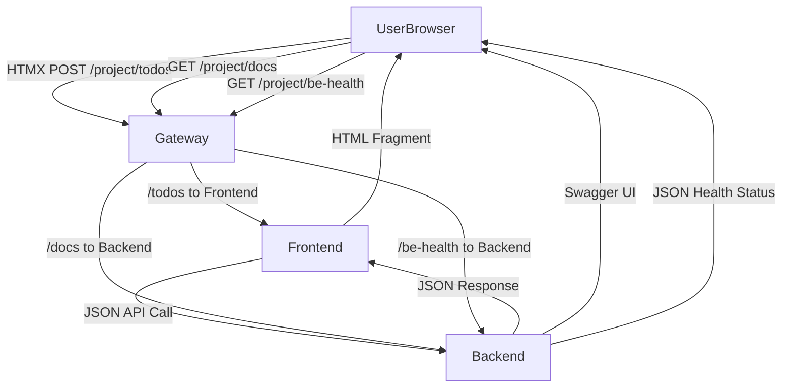

# Todo Application - Microservices Project

Two-service todo application: **todo-backend** (REST API) and **todo-app** (Frontend with image caching). The **todo-cron** service for automated Wikipedia todo generation is available but not part of current deployments.

## Architecture

- **todo-backend** (Port 8001): FastAPI REST API for todo CRUD operations
- **todo-app** (Port 8000): FastAPI frontend with HTMX UI, communicates with backend via HTTP
- **todo-cron**: CronJob service for automated Wikipedia todos (available but not currently deployed)

### Data Flow



## Quick Start

```bash
# Start both services with one command
./start-services.sh

# Or manually:
cd todo-backend && uv sync && uv run python -m src.main &
cd ../todo-app && uv sync && uv run python -m src.main &
```

Access:
- Frontend: http://localhost:8000
- Backend API docs: http://localhost:8001/docs

## Security Features

### XSS Protection ✅
- **Content Security Policy (CSP)**: Strict CSP headers prevent script injection
- **Security Headers**: X-Content-Type-Options, X-Frame-Options, X-XSS-Protection
- **Template Escaping**: Jinja2 auto-escaping prevents XSS in user content
- **Input Validation**: Malicious payloads stored safely as literal text

### SQL Injection Protection ✅  
- **SQLAlchemy ORM**: Parameterized queries prevent SQL injection
- **Input Validation**: Parameter type validation and sanitization
- **Database Integrity**: Comprehensive testing against injection attacks

### API Security
- **Request Logging**: Structured logging with correlation IDs
- **Error Handling**: Secure error responses without information disclosure
- **CORS Configuration**: Configurable cross-origin resource sharing
- **Content Type Validation**: Proper content type enforcement

## Docker Images

### Multi-Architecture Build System

The project supports both local development (ARM64) and cloud deployment (AMD64) with clear architecture-specific image naming:

**ARM64 Images (Local Development):**
- `todo-app-fe:TAG-arm64` - Frontend service for local Docker Compose
- `todo-app-be:TAG-arm64` - Backend service for local Docker Compose  
- `todo-app-cron:TAG-arm64` - Cron service for local Docker Compose

**AMD64 Images (AKS Deployment):**
- `todo-app-fe:TAG-amd64` - Frontend service for Azure Kubernetes Service
- `todo-app-be:TAG-amd64` - Backend service for Azure Kubernetes Service
- `todo-app-cron:TAG-amd64` - Cron service (available but not deployed)

### Environment Configuration
Before running with Docker Compose, set up your environment:

```bash
# Copy the example environment file
cp docker-compose.env.example docker-compose.env

# Edit docker-compose.env with your actual values
# At minimum, set a secure POSTGRES_PASSWORD
```

### Build Both Architectures
```bash
# Build both ARM64 and AMD64 images with specific tag (recommended)
./build-images.sh v1.0.0

# Build with 'latest' tag (prompts for confirmation)
./build-images.sh
```

This creates 6 total images:
- 2 ARM64 images for local development (backend and frontend - automatically used by docker-compose.yaml)
- 2 AMD64 images for AKS deployment (backend and frontend - use in Kubernetes manifests)
- 2 cron images (available but not currently deployed)

### Manual Docker Build
```bash
# ARM64 for local development
cd todo-app && docker build --platform linux/arm64 -t todo-app-fe:v1.0.0-arm64 .
cd todo-backend && docker build --platform linux/arm64 -t todo-app-be:v1.0.0-arm64 .

# AMD64 for AKS deployment  
cd todo-app && docker build --platform linux/amd64 -t todo-app-fe:v1.0.0-amd64 .
cd todo-backend && docker build --platform linux/amd64 -t todo-app-be:v1.0.0-amd64 .
```

## Docker Compose

### Setup & Run
```bash
# 1. Set up environment (first time only)
cp docker-compose.env.example docker-compose.env
# Edit docker-compose.env with your values

# 2. Build and start all services
docker-compose up --build

# Or run in background
docker-compose up -d --build
```

### Configuration
The application uses `docker-compose.env` for environment variables:
- **Security**: File is gitignored to prevent credential leaks
- **Flexibility**: Easy environment switching (dev/staging/prod)
- **Centralized**: All services share common configuration
- **Architecture**: Uses ARM64 images automatically for local development

### Services
- **todo-app-fe**: Frontend on http://localhost:8000 (ARM64 image)
- **todo-app-be**: Backend API on http://localhost:8001 (ARM64 image)
- **postgres_prod**: PostgreSQL database on localhost:5432
- **Persistent data**: Database data persists in Docker volumes
- **Note**: Cron service available but not included in current docker-compose setup

## Kubernetes Deployment

### Manifest Structure
The project uses a hierarchical Kustomization structure for flexible Kubernetes deployments with production-ready Azure Key Vault integration:

```
manifests/
├── base/                          # Base configurations for all environments
│   ├── postgres/                  # PostgreSQL StatefulSet with Azure Key Vault secrets
│   ├── shared/                    # Namespace and Gateway API resources
│   ├── todo-be/                   # Backend Deployment and Service
│   ├── todo-cron/                 # CronJob for automated tasks
│   └── todo-fe/                   # Frontend Deployment, Service, and PVC
└── overlays/                      # Environment-specific configurations
    ├── development/               # Development environment overrides
    ├── staging/                   # Staging environment overrides
    └── production/                # Production environment overrides
```

### Azure Key Vault Integration
The deployment uses Azure Key Vault for secure credential management:

- **Azure Managed Identity**: `keyvault-identity-kube-mooc` with Key Vault Secrets User role
- **Workload Identity**: Federated credential linking Kubernetes ServiceAccount to Azure identity
- **CSI Secrets Store Driver**: Transparent bridge between Azure Key Vault and Kubernetes Secrets
- **PostgreSQL Secrets**: Database credentials stored securely in Azure Key Vault, automatically mounted as Kubernetes secrets

**Key Vault Setup:**
```bash
# Key Vault: kube-mooc-secrets-[timestamp]
# Secrets: postgres-user, postgres-password
# Access: Passwordless authentication via Azure Workload Identity
```

### Deployment Options

**Branch-based environment deployment:**
```bash
# Main branch deploys to 'project' namespace using production overlay
kubectl apply -k manifests/overlays/production/

# Feature branches deploy to 'feature-branch-name' namespace using feature overlay
kubectl apply -k manifests/overlays/feature/
```

**Individual service deployment:**
```bash
# Deploy only the backend (when kustomization.yaml files are created)
kubectl apply -k manifests/base/todo-be/

# Deploy only the database
kubectl apply -k manifests/base/postgres/
```

**Full application deployment:**
```bash
# Deploy all services (when root kustomization.yaml is created)
kubectl apply -k manifests/

# Or manually apply each service in dependency order
kubectl apply -k manifests/base/shared/      # Namespace first
kubectl apply -k manifests/base/postgres/    # Database second
kubectl apply -k manifests/base/todo-be/     # Backend third
kubectl apply -k manifests/base/todo-fe/     # Frontend fourth
kubectl apply -k manifests/base/todo-cron/   # Cron service last
```

**Environment-specific deployments:**
```bash
# Development environment (when overlay kustomization.yaml files are created)
kubectl apply -k manifests/overlays/development/

# Production environment with different resource limits and replicas
kubectl apply -k manifests/overlays/production/
```

### Kustomization Benefits
- **Service Independence**: Deploy and update individual microservices
- **Environment Management**: Different configurations for dev/staging/prod
- **Branch Environments**: Feature branches deploy to isolated namespaces with same configuration
- **Resource Customization**: Environment-specific resource limits, replicas, and secrets
- **GitOps Ready**: Structure supports GitOps deployment patterns

### Branch Environment Strategy
The deployment pipeline creates separate environments for each branch with complete isolation:

- **Main Branch**: Deploys to `project` namespace using `overlays/production/`
- **Feature Branches**: Deploy to `feature-{branch-name}` namespace using `overlays/feature/`
- **Gateway Access**: Feature namespaces automatically labeled with `gateway-access=allowed` for routing
- **Path Isolation**: Each environment uses unique URL paths (`/project/` vs `/feature-{branch}/`)
- **Complete Isolation**: Each feature environment has dedicated resources:
  - Separate namespace with RBAC isolation
  - Isolated Gateway API routes
- **Overlay Maintenance**: Feature overlay patches HTTPRoute paths for a fixed set of endpoints. When adding new public endpoints, update `manifests/overlays/feature/kustomization.yaml` accordingly. CI replaces `BRANCH_NAME` placeholders during deploy.
- **Automatic Cleanup**: Feature environments can be cleaned up when branches are deleted (see [Deprovisioning Feature Environments](../docs/azure/Azure-memos.md#deprovisioning-feature-environments) for detailed cleanup procedures)

**Gateway Label Management:**
```bash
# Automatic labeling in CI/CD (feature branches)
kubectl create namespace feature-my-branch
kubectl label namespace feature-my-branch gateway-access=allowed

# Manual labeling for existing namespaces
kubectl label namespace project gateway-access=allowed
kubectl label namespace exercises gateway-access=allowed
```

**Environment Access Examples:**
- **Production**: http://gateway-url/project/
- **Feature Branch**: http://gateway-url/feature-my-branch/
- **Multiple Features**: http://gateway-url/feature-login/, http://gateway-url/feature-payments/

### Service Access
- **Frontend**: Through Gateway API at `/project/` (main UI and form submissions)
- **Backend API**: Through Gateway API at `/project/docs` for Swagger UI and `/project/be-health` for monitoring
- **Todo Operations**: Form submissions via `/project/todos` route to frontend, which proxies to backend as JSON
- **Health Checks**: `/project/be-health` endpoint routes directly to backend for monitoring
- **Security**: All database credentials managed through Azure Key Vault

### Gateway API Configuration

#### Gateway Access Control
The Gateway API uses a **label-based access control** system for namespace isolation:

**Label Convention:**
```bash
# Required label for gateway access
gateway-access=allowed
```

**Implementation:**
- **Gateway Listener**: Configured with `namespaces.from: Selector` and `matchLabels: {gateway-access: allowed}`
- **Namespace Creation**: Feature branch namespaces automatically receive this label
- **Access Control**: Only namespaces with this label can create HTTPRoutes through the gateway

**Gateway Configuration Example:**
```yaml
# Gateway listener configuration
listeners:
- allowedRoutes:
    kinds:
    - kind: HTTPRoute
    namespaces:
      from: Selector
      selector:
        matchLabels:
          gateway-access: allowed
```

**Adding Gateway Access to Namespaces:**
```bash
# For existing namespaces
kubectl label namespace <namespace-name> gateway-access=allowed

# For new feature environments (done automatically in CI/CD)
kubectl create namespace feature-my-branch
kubectl label namespace feature-my-branch gateway-access=allowed
```

#### HTTPRoute Path Strategy
Different environments use distinct path prefixes to avoid conflicts and enable parallel testing:

**Production Environment (`project` namespace):**
- `/project/todos` → Frontend service (handles form data conversion to JSON)
- `/project/be-health` → Backend service (direct health check access)
- `/project/docs` → Backend service (API documentation)
- `/project/image*` → Frontend service (image caching functionality)
- `/project/` → Frontend service (main UI and catch-all)

**Feature Environments (`feature-{branch}` namespaces):**
- `/feature-{branch}/todos` → Frontend service (isolated testing)
- `/feature-{branch}/be-health` → Backend service (health monitoring)
- `/feature-{branch}/docs` → Backend service (API documentation)
- `/feature-{branch}/image*` → Frontend service (image caching)
- `/feature-{branch}/` → Frontend service (main UI)

**Path Prefix Benefits:**
- **Environment Isolation**: No conflicts between production and feature environments
- **Parallel Testing**: Multiple feature branches can run simultaneously
- **Clear Identification**: URL immediately shows which environment you're accessing
- **Gateway Efficiency**: Single gateway handles all environments with path-based routing

## Azure Deployment

### Azure Resources
- **Resource Group**: `kubernetes-learning` (North Europe region)
- **AKS Cluster**: `kube-mooc` (1 node, monitoring enabled)
- **Azure Key Vault**: `kube-mooc-secrets-[timestamp]` for secure credential storage
- **Managed Identity**: `keyvault-identity-kube-mooc` with Key Vault access
- **Gateway API**: Azure Application Load Balancer integration
- **Location**: North Europe

### Security Architecture
- **Passwordless Authentication**: Azure Workload Identity eliminates hard-coded credentials
- **Secret Rotation**: Azure Key Vault supports automated credential rotation
- **RBAC**: Fine-grained access control with Azure managed identities
- **Audit Trail**: All secret access logged in Azure Activity Log

### Prerequisites
- Azure CLI installed and authenticated
- kubectl configured for the AKS cluster
- **Docker images**: Use AMD64 variants (TAG-amd64) pushed to a container registry (Azure Container Registry)
- Azure Key Vault configured with database credentials
- CSI Secrets Store Driver enabled on AKS cluster
- Azure Workload Identity configured for passwordless authentication

## Testing

### Run All Tests
```bash
# All tests with one command
./test-all.sh

# Individual services
./test-be.sh     # Backend tests (95 tests)
./test-fe.sh     # Frontend tests

# Or manually (from course_project/todo-backend):
cd todo-backend && uv run pytest tests/ -v
cd ../todo-app && uv run pytest tests/ -v
```

### Test Coverage
- **Backend**: 95 tests covering unit tests, integration tests, API validation, security
- **Frontend**: 49 tests covering contract tests, service integration, UI components, security
- **Security**: 20 tests specifically for XSS and SQL injection prevention
- **Philosophy**: Each service tested independently for microservice isolation

See `todo-backend/tests/TEST_PLAN.md` for comprehensive testing documentation.

## Feature Branch Deployment Strategy

### Current Implementation: Dynamic Azure Workload Identity
The current GitHub Actions workflow (`deploy-feature-branches.yml`) creates dedicated Azure federated identity credentials for each feature branch:

**Pros:**
- Complete isolation between feature environments
- Proper Azure security model with exact subject matching
- Easy cleanup when feature branches are deleted (see [Azure-memos.md](../docs/azure/Azure-memos.md#deprovisioning-feature-environments) for detailed cleanup procedures)

**Cons:**
- Increased Azure AD resource creation overhead
- Complex credential lifecycle management
- Potential security concerns with dynamic identity creation in CI/CD

#### How Feature Environment Federated Credentials Work

When a feature branch is pushed, the GitHub Actions workflow creates a dedicated Azure federated credential that enables secure, passwordless access to Azure Key Vault for that specific feature environment.

**The Provisioning Process:**
```bash
# 1. Extract branch name from GitHub context
BRANCH_NAME=$(echo "${GITHUB_REF#refs/heads/}" | sed 's/[^a-zA-Z0-9-]/-/g')

# 2. Create branch-specific federated credential
az identity federated-credential create \
  --name "postgres-workload-identity-${BRANCH_NAME}" \
  --identity-name "keyvault-identity-kube-mooc" \
  --resource-group "kubernetes-learning" \
  --issuer "${AKS_OIDC_ISSUER}" \
  --subject "system:serviceaccount:feature-${BRANCH_NAME}:postgres-service-account"
```

**Security Architecture:**
- **Managed Identity**: Uses existing `keyvault-identity-kube-mooc` (not creating new identities)
- **Subject Isolation**: Each branch gets unique subject: `system:serviceaccount:feature-BRANCH_NAME:postgres-service-account`
- **Namespace Isolation**: Same service account name (`postgres-service-account`) works across namespaces due to subject specificity
- **Automatic Trust**: Azure validates OIDC tokens from the specific namespace/service account combination

**Key Benefits:**
- **No Shared Secrets**: Each environment has independent Key Vault access
- **Same Service Account Name**: Simplifies manifest maintenance across environments
- **Secure Isolation**: Azure validates exact namespace/service account match
- **Temporary Access**: Credentials only work while namespace exists

**The Authentication Flow:**
1. Pod starts with service account `postgres-service-account` in namespace `feature-BRANCH_NAME`
2. CSI Secrets Store driver requests OIDC token from Kubernetes
3. Token includes subject: `system:serviceaccount:feature-BRANCH_NAME:postgres-service-account`
4. Azure validates token against federated credential `postgres-workload-identity-BRANCH_NAME`
5. Azure grants temporary access to Key Vault secrets
6. Database credentials mounted into pod securely

This architecture enables the same `postgres-service-account` name across all feature environments while maintaining complete security isolation through Azure's federated credential trust relationships.

### Alternative Approach: Shared Database with Logical Isolation
An alternative architecture would use a shared database with multiple workload identities:

**Concept:**
- Single PostgreSQL instance shared across all feature environments
- Multiple Azure Workload Identity credentials with naming pattern `feature-*-workload-identity`
- Logical separation using database schemas or prefixed table names
- Reduced Azure resource overhead

**Implementation Considerations:**
```bash
# Create multiple federated credentials upfront
az identity federated-credential create \
  --name "feature-database-access" \
  --subject "system:serviceaccount:feature-*:postgres-service-account" \
  --identity-name keyvault-identity-kube-mooc

# Note: Azure doesn't support wildcard subjects, so this would require
# pre-provisioning credentials for expected feature branch patterns
```

**Trade-offs:**
- **Pros**: Reduced credential management, shared database resources, simpler Key Vault access
- **Cons**: Less isolation, potential data bleed between environments, complex cleanup

**Status**: Current implementation uses per-branch credentials for maximum isolation. The shared database approach could be evaluated for future optimization if the credential overhead becomes problematic.

## CI/CD Pipeline

Modern GitOps-style pipeline with **separate Azure identities** for CI and CD stages, following security best practices:

### Azure Identity Architecture

The pipeline uses **two dedicated Azure Managed Identities** for secure, passwordless authentication:

#### CI Identity (`github-actions-ci`)
- **Purpose**: Build and push tested images during pull request validation
- **Permissions**: `AcrPush` role on Azure Container Registry only
- **Scope**: Triggered by `pull_request` events on any branch
- **Client ID**: `a7c70b35-0eb3-4363-b0e1-1c48bae476cc`
- **Security**: Minimal permissions following principle of least privilege

#### CD Identity (`github-actions-todo-cd`)  
- **Purpose**: Deploy applications to AKS after main branch merge
- **Permissions**: AKS deployment permissions + ACR access
- **Scope**: Triggered only by pushes to `main` branch
- **Client ID**: `d2e20c1d-c71a-43d8-ba21-463212e9596f`  
- **Security**: Broader permissions but restricted to production deployments

**Why Separate Identities?**
- **Blast Radius Control**: Compromised CI identity cannot deploy to production
- **Future-Proof**: Ready for separate test databases and staging clusters
- **Audit Clarity**: Clear separation between build and deployment activities
- **Permission Scoping**: Each stage has only the minimum required access

### Pipeline Architecture
```mermaid
graph TD
    A[Push/PR to any branch] --> B[CI Pipeline - Microservices]
    B --> C{All tests pass?}
    C -->|Yes| D[Build & Push Images to ACR]
    D --> E{Branch type?}
    E -->|main branch| F[Production Deployment]
    E -->|feature branch| G[Feature Branch Deployment]
    F --> H[Deploy to project namespace]
    G --> I[Deploy to feature-{branch} namespace]
    C -->|No| J[Pipeline fails - no deployment]
```

### CI Pipeline (`ci.yml`) ###
Sequential testing strategy with secure image building:
1. **Code Quality**: Ruff linting and formatting for both services
2. **Backend Tests**: Unit and integration tests with PostgreSQL
3. **Frontend Tests**: Service integration with mocked backend
4. **Service Integration**: Docker containers with real service communication
5. **Image Building**: Build and push tested images to ACR using **CI identity**

**Authentication Architecture:**
- Uses `AZURE_CI_CLIENT_ID` secret with `pull_request` federated credential
- Federated credential subject: `repo:rjpalt/KubernetesMOOC:pull_request`
- Permissions: `AcrPush` role only (cannot deploy to AKS)
- Scope: Triggered on ANY pull request to main branch

**Services Covered:**
- **Backend**: `kubemooc.azurecr.io/todo-app-be:{branch}-{sha}`
- **Frontend**: `kubemooc.azurecr.io/todo-app-fe:{branch}-{sha}`

**Key Features:**
- **Only tested code is built** - Images only created after all tests pass
- **Consistent tagging** - `kubemooc.azurecr.io/todo-app-be:feature-my-branch-abc123def`
- **Multi-platform** - AMD64 images for AKS deployment
- **Build cache** - GitHub Actions cache for faster subsequent builds
- **Secure by default** - Minimal Azure permissions for CI operations

### Image Tagging Strategy (Concise)
- Pull request builds tag images as `{branch}-{headSha}` where `headSha = github.event.pull_request.head.sha`.
- Reason: The feature deploy workflow (workflow_run) receives only the PR head SHA (not the synthetic merge SHA `github.sha`).
- Production (push to main) uses the normal commit SHA (no divergence between merge/head on main).
- Example tag: `feature-login-4694cc19a5e0c7f37e86a55b8e6a7223616cf44a`.

### If Feature Deployment Cannot Find Image Tag
1. Compare PR head SHA in CI summary with `IMAGE_TAG_SUFFIX` in deploy logs.
2. List tags (backend): `az acr repository show-tags --name kubemooc --repository todo-app-be -o tsv | grep <branch>`
3. If missing, re-run CI (ensures rebuild with head SHA) then deployment will succeed.

(No dual tagging kept to avoid registry clutter.)

### Branch Environment Deployment
Two separate deployment pipelines ensure proper isolation:

#### Production Deployment (`deploy-production.yml`)
- **Trigger**: Push to main branch (merge from PR)
- **Authentication**: Uses `AZURE_CLIENT_ID` secret with **CD identity**
- **Federated Credential**: `repo:rjpalt/KubernetesMOOC:ref:refs/heads/main`
- **Permissions**: Full AKS deployment + ACR access
- **Target**: `project` namespace using `overlays/production/`
- **Images**: Builds fresh images for production (independent validation)
- **Tests**: Runs own test suite before deployment
- **Strategy**: Independent pipeline for production reliability

#### Feature Branch Deployment (`deploy-feature-branches.yml`)  
- **Trigger**: After CI pipeline completes successfully (non-main branches)
- **Authentication**: Uses `AZURE_CLIENT_ID` secret with **CD identity**
- **Images**: Uses tested images from CI pipeline (no rebuilding)
- **Target**: `feature-{branch-name}` namespace using `overlays/feature/`
- **Services**: Deploys backend and frontend services only
- **Namespace**: Auto-creates with `gateway-access=allowed` label for Gateway API access
- **HTTPRoute Patching**: Uses Kustomization patches for Infrastructure as Code approach
- **Health Checks**: Verifies both services respond correctly

**HTTPRoute Path Management:**
```bash
# Current approach: Kustomization patches with placeholder replacement
cd course_project/manifests/overlays/feature
kustomize edit set namespace feature-branch-name
sed -i "s/BRANCH_NAME/branch-name/g" kustomization.yaml
kustomize build . | kubectl apply -f -
```

The feature overlay uses Kustomization patches to modify HTTPRoute paths declaratively:

```yaml
# manifests/overlays/feature/kustomization.yaml
apiVersion: kustomize.config.k8s.io/v1beta1
kind: Kustomization

resources:
  - ../../base

patches:
- target:
    kind: HTTPRoute
    name: todo-app
  patch: |-
    - op: replace
      path: /spec/rules/0/matches/0/path/value
      value: /feature-BRANCH_NAME/be-health
    - op: replace
      path: /spec/rules/1/matches/0/path/value
      value: /feature-BRANCH_NAME/docs/
    # ... additional path updates
    name: todo-app
  patch: |-
    - op: replace
      path: /spec/rules/0/matches/0/path/value
      value: /feature-PLACEHOLDER/be-health
    - op: replace
      path: /spec/rules/1/matches/0/path/value
      value: /feature-PLACEHOLDER/docs/
    # Additional path replacements...

# CI/CD would then replace PLACEHOLDER with actual branch name
# sed -i 's/PLACEHOLDER/${BRANCH_NAME}/g' kustomization.yaml
```

### HTTPRoute Management Approaches

#### Current Approach: Kustomization Patches with Placeholders
The current implementation uses Infrastructure as Code approach with Kustomization patches:

**Pros:**
- **Declarative**: All routing configuration in version control
- **GitOps Friendly**: Infrastructure changes visible in manifests
- **Maintainable**: Centralized routing configuration management
- **Consistent**: Same patching mechanism across all feature branches
- **Simple**: Minimal CI/CD logic required

**Implementation:**
```bash
# In deploy-feature-branches.yml
cd course_project/manifests/overlays/feature
kustomize edit set namespace ${{ env.NAMESPACE }}
sed -i "s/BRANCH_NAME/${{ env.BRANCH_NAME }}/g" kustomization.yaml
kustomize build . | kubectl apply -f -
```

```yaml
# manifests/overlays/feature/kustomization.yaml
patches:
- target:
    kind: HTTPRoute
    name: todo-app
  patch: |-
    - op: replace
      path: /spec/rules/0/matches/0/path/value
      value: /feature-BRANCH_NAME/be-health
    - op: replace
      path: /spec/rules/1/matches/0/path/value
      value: /feature-BRANCH_NAME/docs/
    # ... additional path updates
```

#### Previous Approach: Runtime Patching in CI/CD
Alternative implementation that patches HTTPRoute paths dynamically during deployment:

**Pros:**
- **Simple**: No Kustomization patch management
- **Flexible**: Easy to modify paths without changing manifests
- **Debugging**: Clear kubectl commands visible in CI/CD logs

**Cons:**
- **Imperative**: Changes not visible in version control
- **Complex CI/CD**: More logic in deployment pipeline

**Implementation Example:**
```bash
# Previous kubectl patch approach (not used)
kubectl patch httproute todo-app -n ${{ env.NAMESPACE }} --type='json' -p='[
  {"op": "replace", "path": "/spec/rules/0/matches/0/path/value", "value": "/feature-${{ env.BRANCH_NAME }}/be-health"},
  # ... additional path updates
]'
```

**Migration Completed:**
The project has migrated from runtime `kubectl patch` to declarative Kustomization patches. This provides better GitOps alignment and Infrastructure as Code principles while maintaining the same functionality.

**Benefits of Current Approach:**
- All HTTPRoute configuration visible in version control
- Consistent Infrastructure as Code approach
- Simplified CI/CD pipeline logic  
- Better maintainability and debugging
- Standard Kustomization patterns

### Local CI Testing with ACT

Test GitHub Actions pipeline locally using [act](https://github.com/nektos/act):

```bash
# Test specific jobs
act --job test-backend
act --job test-frontend
act --job code-quality
```

#### ACT Setup Requirements

ACT requires a `.secrets` file for local testing with GitHub secrets:

```bash
# Copy the example secrets file
cp .secrets.example .secrets

# Or create manually (this file is gitignored)
cat > .secrets << EOF
TEST_POSTGRES_USER=test_user
TEST_POSTGRES_PASSWORD=test_password123
EOF
```

The workflow automatically detects ACT execution (`github.actor == 'nektos/act'`) and sets appropriate environment variables for database testing.

## Features

- Todo CRUD operations with 140-character validation
- Automatic image fetching from picsum.photos
- Health check endpoints for monitoring
- OpenAPI documentation for both services
- **Security**: XSS prevention, SQL injection protection, security headers
- **Testing**: Comprehensive test coverage including security testing
- **Observability**: Request logging with correlation IDs
- Codecov on project pages for front and backend coverage
