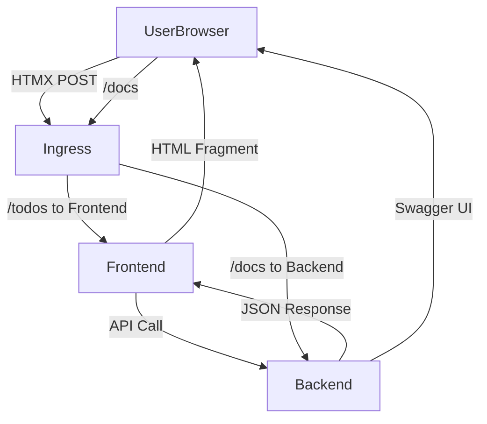

# Todo Application - Microservices Project

Two-service todo application: **todo-backend** (REST API) and **todo-app** (Frontend with image caching).

## Architecture

- **todo-backend** (Port 8001): FastAPI REST API for todo CRUD operations
- **todo-app** (Port 8000): FastAPI frontend with HTMX UI, communicates with backend via HTTP

### Data Flow



## Quick Start

```bash
# Start both services with one command
./start-services.sh

# Or manually:
cd todo-backend && uv sync && uv run python -m src.main &
cd ../todo-app && uv sync && uv run python -m src.main &
```

Access:
- Frontend: http://localhost:8000
- Backend API docs: http://localhost:8001/docs

## Docker Images

### Environment Configuration
Before running with Docker Compose, set up your environment:

```bash
# Copy the example environment file
cp docker-compose.env.example docker-compose.env

# Edit docker-compose.env with your actual values
# At minimum, set a secure POSTGRES_PASSWORD
```

### Build Both Services
```bash
# Build with specific tag (recommended)
./build-images.sh v1.0.0

# Build with 'latest' tag (prompts for confirmation)
./build-images.sh
```

This creates:
- `todo-app-fe:TAG` - Frontend service image
- `todo-app-be:TAG` - Backend service image

### Manual Docker Build
```bash
# Frontend
cd todo-app && docker build -t todo-app-fe:v1.0.0 .

# Backend  
cd todo-backend && docker build -t todo-app-be:v1.0.0 .
```

## Docker Compose

### Setup & Run
```bash
# 1. Set up environment (first time only)
cp docker-compose.env.example docker-compose.env
# Edit docker-compose.env with your values

# 2. Build and start all services
docker-compose up --build

# Or run in background
docker-compose up -d --build
```

### Configuration
The application uses `docker-compose.env` for environment variables:
- **Security**: File is gitignored to prevent credential leaks
- **Flexibility**: Easy environment switching (dev/staging/prod)
- **Centralized**: All services share common configuration

### Services
- **todo-app-fe**: Frontend on http://localhost:8000
- **todo-app-be**: Backend API on http://localhost:8001
- **postgres_prod**: PostgreSQL database on localhost:5432
- **Persistent data**: Database data persists in Docker volumes

## Azure Deployment

### Azure Resources
- **Resource Group**: `kubernetes-learning` (North Europe region)
- **AKS Cluster**: `kube-mooc` (1 node, monitoring enabled)
- **Location**: North Europe

### Prerequisites
- Azure CLI installed and authenticated
- kubectl configured for the AKS cluster
- Docker images pushed to a container registry

## Testing

### Run All Tests
```bash
# All tests with one command
./test-all.sh

# Individual services
./test-be.sh     # Backend tests (58 tests)
./test-fe.sh     # Frontend tests

# Or manually (from course_project/todo-backend):
cd todo-backend && uv run pytest tests/ -v
cd ../todo-app && uv run pytest tests/ -v
```

### Test Coverage
- **Backend**: 58 tests covering unit tests, integration tests, API validation
- **Frontend**: Contract tests, service integration, UI components  
- **Philosophy**: Each service tested independently for microservice isolation

See `todo-backend/tests/TEST_PLAN.md` for comprehensive testing documentation.

## CI/CD Pipeline

Sequential testing strategy in `.github/workflows/test.yml`:
1. **Backend Tests**: API contracts and business logic
2. **Frontend Tests**: Service integration with mocked backend
3. **Integration Tests**: Docker containers with real service communication

### Local CI Testing with ACT

Test GitHub Actions pipeline locally using [act](https://github.com/nektos/act):

```bash
# Test specific jobs
act --job test-backend
act --job test-frontend
act --job code-quality
```

#### ACT Setup Requirements

ACT requires a `.secrets` file for local testing with GitHub secrets:

```bash
# Copy the example secrets file
cp .secrets.example .secrets

# Or create manually (this file is gitignored)
cat > .secrets << EOF
TEST_POSTGRES_USER=test_user
TEST_POSTGRES_PASSWORD=test_password123
EOF
```

The workflow automatically detects ACT execution (`github.actor == 'nektos/act'`) and sets appropriate environment variables for database testing.

## Features

- Todo CRUD operations with 140-character validation
- Automatic image fetching from picsum.photos
- Health check endpoints for monitoring
- OpenAPI documentation for both services
- Codecov on project pages for front and backend coverage
