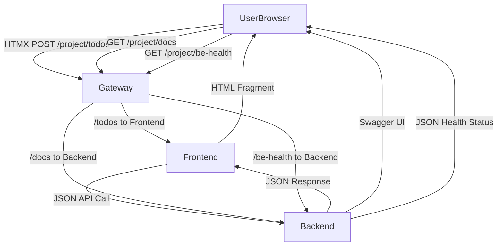

# Todo Application - Microservices Project

Three-service todo application: **todo-backend** (REST API), **todo-app** (Frontend with image caching), and **todo-cron** (Automated Wikipedia todo generation).

## Architecture

- **todo-backend** (Port 8001): FastAPI REST API for todo CRUD operations
- **todo-app** (Port 8000): FastAPI frontend with HTMX UI, communicates with backend via HTTP
- **todo-cron**: CronJob service that creates todos with random Wikipedia articles hourly

### Data Flow



## Quick Start

```bash
# Start both services with one command
./start-services.sh

# Or manually:
cd todo-backend && uv sync && uv run python -m src.main &
cd ../todo-app && uv sync && uv run python -m src.main &
```

Access:
- Frontend: http://localhost:8000
- Backend API docs: http://localhost:8001/docs

## Security Features

### XSS Protection ✅
- **Content Security Policy (CSP)**: Strict CSP headers prevent script injection
- **Security Headers**: X-Content-Type-Options, X-Frame-Options, X-XSS-Protection
- **Template Escaping**: Jinja2 auto-escaping prevents XSS in user content
- **Input Validation**: Malicious payloads stored safely as literal text

### SQL Injection Protection ✅  
- **SQLAlchemy ORM**: Parameterized queries prevent SQL injection
- **Input Validation**: Parameter type validation and sanitization
- **Database Integrity**: Comprehensive testing against injection attacks

### API Security
- **Request Logging**: Structured logging with correlation IDs
- **Error Handling**: Secure error responses without information disclosure
- **CORS Configuration**: Configurable cross-origin resource sharing
- **Content Type Validation**: Proper content type enforcement

## Docker Images

### Multi-Architecture Build System

The project supports both local development (ARM64) and cloud deployment (AMD64) with clear architecture-specific image naming:

**ARM64 Images (Local Development):**
- `todo-app-fe:TAG-arm64` - Frontend service for local Docker Compose
- `todo-app-be:TAG-arm64` - Backend service for local Docker Compose  
- `todo-app-cron:TAG-arm64` - Cron service for local Docker Compose

**AMD64 Images (AKS Deployment):**
- `todo-app-fe:TAG-amd64` - Frontend service for Azure Kubernetes Service
- `todo-app-be:TAG-amd64` - Backend service for Azure Kubernetes Service
- `todo-app-cron:TAG-amd64` - Cron service for Azure Kubernetes Service

### Environment Configuration
Before running with Docker Compose, set up your environment:

```bash
# Copy the example environment file
cp docker-compose.env.example docker-compose.env

# Edit docker-compose.env with your actual values
# At minimum, set a secure POSTGRES_PASSWORD
```

### Build Both Architectures
```bash
# Build both ARM64 and AMD64 images with specific tag (recommended)
./build-images.sh v1.0.0

# Build with 'latest' tag (prompts for confirmation)
./build-images.sh
```

This creates 6 total images:
- 3 ARM64 images for local development (automatically used by docker-compose.yaml)
- 3 AMD64 images for AKS deployment (use in Kubernetes manifests)

### Manual Docker Build
```bash
# ARM64 for local development
cd todo-app && docker build --platform linux/arm64 -t todo-app-fe:v1.0.0-arm64 .
cd todo-backend && docker build --platform linux/arm64 -t todo-app-be:v1.0.0-arm64 .

# AMD64 for AKS deployment  
cd todo-app && docker build --platform linux/amd64 -t todo-app-fe:v1.0.0-amd64 .
cd todo-backend && docker build --platform linux/amd64 -t todo-app-be:v1.0.0-amd64 .
```

## Docker Compose

### Setup & Run
```bash
# 1. Set up environment (first time only)
cp docker-compose.env.example docker-compose.env
# Edit docker-compose.env with your values

# 2. Build and start all services
docker-compose up --build

# Or run in background
docker-compose up -d --build
```

### Configuration
The application uses `docker-compose.env` for environment variables:
- **Security**: File is gitignored to prevent credential leaks
- **Flexibility**: Easy environment switching (dev/staging/prod)
- **Centralized**: All services share common configuration
- **Architecture**: Uses ARM64 images automatically for local development

### Services
- **todo-app-fe**: Frontend on http://localhost:8000 (ARM64 image)
- **todo-app-be**: Backend API on http://localhost:8001 (ARM64 image)
- **postgres_prod**: PostgreSQL database on localhost:5432
- **Persistent data**: Database data persists in Docker volumes

## Kubernetes Deployment

### Manifest Structure
The project uses a hierarchical Kustomization structure for flexible Kubernetes deployments with production-ready Azure Key Vault integration:

```
manifests/
├── base/                          # Base configurations for all environments
│   ├── postgres/                  # PostgreSQL StatefulSet with Azure Key Vault secrets
│   ├── shared/                    # Namespace and Gateway API resources
│   ├── todo-be/                   # Backend Deployment and Service
│   ├── todo-cron/                 # CronJob for automated tasks
│   └── todo-fe/                   # Frontend Deployment, Service, and PVC
└── overlays/                      # Environment-specific configurations
    ├── development/               # Development environment overrides
    ├── staging/                   # Staging environment overrides
    └── production/                # Production environment overrides
```

### Azure Key Vault Integration
The deployment uses Azure Key Vault for secure credential management:

- **Azure Managed Identity**: `keyvault-identity-kube-mooc` with Key Vault Secrets User role
- **Workload Identity**: Federated credential linking Kubernetes ServiceAccount to Azure identity
- **CSI Secrets Store Driver**: Transparent bridge between Azure Key Vault and Kubernetes Secrets
- **PostgreSQL Secrets**: Database credentials stored securely in Azure Key Vault, automatically mounted as Kubernetes secrets

**Key Vault Setup:**
```bash
# Key Vault: kube-mooc-secrets-[timestamp]
# Secrets: postgres-user, postgres-password
# Access: Passwordless authentication via Azure Workload Identity
```

### Deployment Options

**Branch-based environment deployment:**
```bash
# Main branch deploys to 'project' namespace using production overlay
kubectl apply -k manifests/overlays/production/

# Feature branches deploy to 'feature-branch-name' namespace using feature overlay
kubectl apply -k manifests/overlays/feature/
```

**Individual service deployment:**
```bash
# Deploy only the backend (when kustomization.yaml files are created)
kubectl apply -k manifests/base/todo-be/

# Deploy only the database
kubectl apply -k manifests/base/postgres/
```

**Full application deployment:**
```bash
# Deploy all services (when root kustomization.yaml is created)
kubectl apply -k manifests/

# Or manually apply each service in dependency order
kubectl apply -k manifests/base/shared/      # Namespace first
kubectl apply -k manifests/base/postgres/    # Database second
kubectl apply -k manifests/base/todo-be/     # Backend third
kubectl apply -k manifests/base/todo-fe/     # Frontend fourth
kubectl apply -k manifests/base/todo-cron/   # Cron service last
```

**Environment-specific deployments:**
```bash
# Development environment (when overlay kustomization.yaml files are created)
kubectl apply -k manifests/overlays/development/

# Production environment with different resource limits and replicas
kubectl apply -k manifests/overlays/production/
```

### Kustomization Benefits
- **Service Independence**: Deploy and update individual microservices
- **Environment Management**: Different configurations for dev/staging/prod
- **Branch Environments**: Feature branches deploy to isolated namespaces with same configuration
- **Resource Customization**: Environment-specific resource limits, replicas, and secrets
- **GitOps Ready**: Structure supports GitOps deployment patterns

### Branch Environment Strategy
The deployment pipeline creates separate environments for each branch:

- **Main Branch**: Deploys to `project` namespace using `overlays/production/`
- **Feature Branches**: Deploy to `feature-{branch-name}` namespace using `overlays/feature/`
- **Gateway Access**: Feature namespaces labeled with `gateway-access=allowed` for routing
- **Isolation**: Each feature environment is completely isolated with its own resources
- **Same Configuration**: Feature environments use identical resource limits as production
- **Automatic Cleanup**: Feature environments can be cleaned up when branches are deleted

### Service Access
- **Frontend**: Through Gateway API at `/project/` (main UI and form submissions)
- **Backend API**: Through Gateway API at `/project/docs` for Swagger UI and `/project/be-health` for monitoring
- **Todo Operations**: Form submissions via `/project/todos` route to frontend, which proxies to backend as JSON
- **Health Checks**: `/project/be-health` endpoint routes directly to backend for monitoring
- **Security**: All database credentials managed through Azure Key Vault

### Gateway API Routing
The HTTPRoute configuration provides intelligent routing:
- `/project/todos` → Frontend service (handles form data conversion to JSON)
- `/project/be-health` → Backend service (direct health check access)
- `/project/docs` → Backend service (API documentation)
- `/project/image*` → Frontend service (image caching functionality)
- `/project/` → Frontend service (main UI and catch-all)

## Azure Deployment

### Azure Resources
- **Resource Group**: `kubernetes-learning` (North Europe region)
- **AKS Cluster**: `kube-mooc` (1 node, monitoring enabled)
- **Azure Key Vault**: `kube-mooc-secrets-[timestamp]` for secure credential storage
- **Managed Identity**: `keyvault-identity-kube-mooc` with Key Vault access
- **Gateway API**: Azure Application Load Balancer integration
- **Location**: North Europe

### Security Architecture
- **Passwordless Authentication**: Azure Workload Identity eliminates hard-coded credentials
- **Secret Rotation**: Azure Key Vault supports automated credential rotation
- **RBAC**: Fine-grained access control with Azure managed identities
- **Audit Trail**: All secret access logged in Azure Activity Log

### Prerequisites
- Azure CLI installed and authenticated
- kubectl configured for the AKS cluster
- **Docker images**: Use AMD64 variants (TAG-amd64) pushed to a container registry (Azure Container Registry)
- Azure Key Vault configured with database credentials
- CSI Secrets Store Driver enabled on AKS cluster
- Azure Workload Identity configured for passwordless authentication

## Testing

### Run All Tests
```bash
# All tests with one command
./test-all.sh

# Individual services
./test-be.sh     # Backend tests (95 tests)
./test-fe.sh     # Frontend tests

# Or manually (from course_project/todo-backend):
cd todo-backend && uv run pytest tests/ -v
cd ../todo-app && uv run pytest tests/ -v
```

### Test Coverage
- **Backend**: 95 tests covering unit tests, integration tests, API validation, security
- **Frontend**: 49 tests covering contract tests, service integration, UI components, security
- **Security**: 20 tests specifically for XSS and SQL injection prevention
- **Philosophy**: Each service tested independently for microservice isolation

See `todo-backend/tests/TEST_PLAN.md` for comprehensive testing documentation.

## CI/CD Pipeline

Sequential testing strategy in `.github/workflows/test.yml`:
1. **Backend Tests**: API contracts and business logic
2. **Frontend Tests**: Service integration with mocked backend
3. **Integration Tests**: Docker containers with real service communication

### Branch Environment Deployment
The deployment pipeline creates separate environments for each branch:

```yaml
# Example deployment pipeline logic
if [ "$BRANCH_NAME" = "main" ]; then
  NAMESPACE="project"
  cd course_project/manifests/overlays/production/
  # No namespace creation needed - already exists
  # No labeling needed - already allowed in Gateway
else
  NAMESPACE="feature-$BRANCH_NAME"
  cd course_project/manifests/overlays/feature/
  kubectl create namespace $NAMESPACE || true
  kubectl label namespace $NAMESPACE gateway-access=allowed --overwrite
  kustomize edit set namespace $NAMESPACE
fi

kustomize edit set image [branch-specific-images...]
kustomize build . | kubectl apply -f -
```

**Benefits:**
- **Integration Testing**: Test features in production-like environment
- **Stakeholder Review**: Product managers can test features before merge
- **Parallel Development**: Multiple developers work on features simultaneously
- **E2E Testing Foundation**: Perfect environment for automated end-to-end tests

### Local CI Testing with ACT

Test GitHub Actions pipeline locally using [act](https://github.com/nektos/act):

```bash
# Test specific jobs
act --job test-backend
act --job test-frontend
act --job code-quality
```

#### ACT Setup Requirements

ACT requires a `.secrets` file for local testing with GitHub secrets:

```bash
# Copy the example secrets file
cp .secrets.example .secrets

# Or create manually (this file is gitignored)
cat > .secrets << EOF
TEST_POSTGRES_USER=test_user
TEST_POSTGRES_PASSWORD=test_password123
EOF
```

The workflow automatically detects ACT execution (`github.actor == 'nektos/act'`) and sets appropriate environment variables for database testing.

## Features

- Todo CRUD operations with 140-character validation
- Automatic image fetching from picsum.photos
- Health check endpoints for monitoring
- OpenAPI documentation for both services
- **Security**: XSS prevention, SQL injection protection, security headers
- **Testing**: Comprehensive test coverage including security testing
- **Observability**: Request logging with correlation IDs
- Codecov on project pages for front and backend coverage
