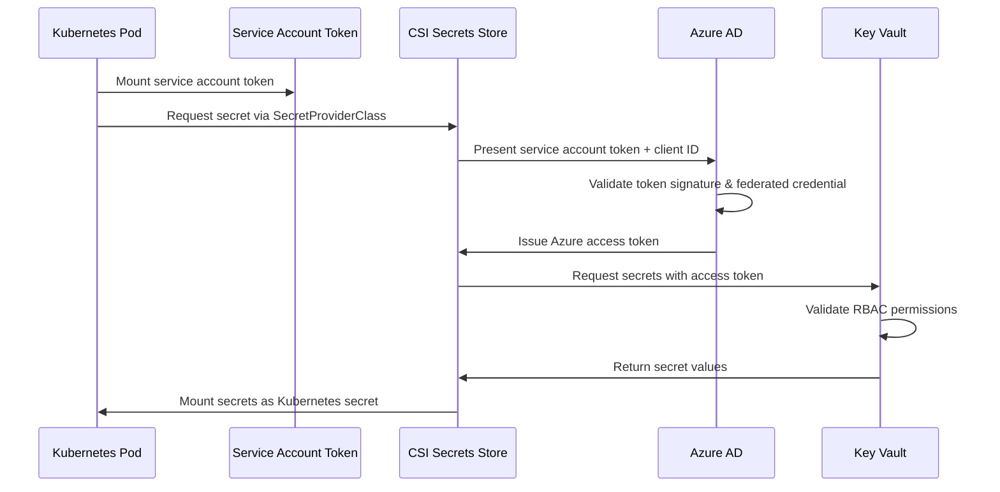

# Kubernetes Manifests - GitOps with Kustomize

This directory contains Kubernetes manifests organized for GitOps deployment via ArgoCD and Kustomize, enabling automated, Git-driven deployments across multiple environments.

## GitOps Architecture Overview

**Current State**: Production and staging environments are managed by ArgoCD following pure GitOps principles:

- **Git as Source of Truth**: All infrastructure changes committed to this repository
- **Automated Sync**: ArgoCD Applications monitor respective overlays and sync automatically
- **Self-Healing**: Configuration drift is automatically corrected
- **Audit Trail**: Complete deployment history preserved in Git commits

**ArgoCD Applications**: 
- Production: [`cluster-manifests/main-app.yaml`](../../cluster-manifests/main-app.yaml) → `overlays/production/`
- Staging: [`cluster-manifests/argocd-application-staging.yaml`](../../cluster-manifests/argocd-application-staging.yaml) → `overlays/staging/`

## Directory Structure

```
manifests/
├── base/                          # Base configurations (environment-agnostic)
│   ├── shared/                    # Shared resources (namespace, ingress)
│   │   ├── namespace.yaml
│   │   └── ingress.yaml
│   ├── postgres/                  # PostgreSQL database
│   │   ├── statefulset.yaml
│   │   ├── service.yaml
│   │   ├── secrets.yaml
│   │   └── secrets.enc.yaml
│   ├── nats/                      # NATS message bus infrastructure
│   │   ├── statefulset.yaml      # 2-container pod (nats + metrics-exporter)
│   │   ├── service.yaml          # Main NATS service (port 4222)
│   │   ├── metrics-service.yaml  # Prometheus metrics service (port 7777)
│   │   ├── configmap.yaml        # NATS server configuration
│   │   └── kustomization.yaml    # Base resource list
│   ├── todo-be/                   # Backend API service
│   │   ├── deployment.yaml
│   │   └── service.yaml
│   ├── todo-fe/                   # Frontend web service
│   │   ├── deployment.yaml
│   │   ├── service.yaml
│   │   ├── persistentvolume.yaml
│   │   └── persistentvolumeclaim.yaml
│   ├── todo-cron/                 # Scheduled Wikipedia todo generation
│   │   └── cronjob.yaml
│   └── broadcaster/               # NATS to HTTP webhook broadcaster service
│       ├── deployment.yaml       # FastAPI service with NATS consumer
│       ├── service.yaml          # Main HTTP service (port 8002)
│       ├── metrics-service.yaml  # Prometheus metrics service (port 7777)
│       ├── secret-template.yaml  # Webhook URL configuration
│       └── kustomization.yaml    # Base resource list
└── overlays/                      # Environment-specific overrides
    ├── feature/                   # Feature branch application manifests (Azure Function managed)
    │   ├── kustomization.yaml     # Dynamic BRANCH_NAME placeholders
    │   └── nats-feature-patch.yaml
    ├── staging/                   # Staging environment settings (✅ ArgoCD managed)
    │   ├── kustomization.yaml     # Main staging orchestrator
    │   ├── resourcequota.yaml     # 2000m CPU, 2048Mi memory limits
    │   ├── hpa-backend.yaml       # Backend autoscaling (1-2 replicas)
    │   ├── hpa-frontend.yaml      # Frontend autoscaling (1-2 replicas)
    │   ├── hpa-broadcaster.yaml   # Broadcaster autoscaling (1-2 replicas)
    │   └── nats-staging-patch.yaml # Single-replica NATS for cost optimization
    ├── production/                # Production environment settings (✅ ArgoCD managed)
    │   ├── nats/                  # NATS production overlay
    │   │   ├── nats-prod-patch.yaml
    │   │   └── kustomization.yaml
    │   ├── hpa-backend.yaml       # Backend autoscaling (1-5 replicas)
    │   ├── hpa-frontend.yaml      # Frontend autoscaling (1-3 replicas)
    │   ├── hpa-broadcaster.yaml   # Broadcaster autoscaling (1-5 replicas)
    │   ├── resourcequota.yaml     # 3000m CPU, 3072Mi memory limits
    │   └── kustomization.yaml     # Production configuration (ArgoCD sync target)
    ├── azure-feature/             # Azure monitoring for feature branches
    │   ├── ama-metrics-settings.yaml
    │   ├── ama-metrics-prometheus-config.yaml
    │   └── kustomization.yaml
    └── azure-production/          # Azure monitoring for production
        ├── ama-metrics-settings.yaml
        ├── ama-metrics-prometheus-config.yaml
        └── kustomization.yaml
```

## Base Shared Resources

### Overview

The `base/shared/` directory contains environment-agnostic resources that are shared across all deployments (feature, staging, production). These resources are included by all overlays and transformed to match the target namespace.

**Important**: The `base/shared/` directory **does not** contain a namespace manifest. Each overlay defines its own namespace to prevent Kustomize transformation conflicts and enable environment-specific gateway labels.

### Namespace Strategy (Updated October 2025)

**Architecture Pattern**: Each overlay defines its own namespace manifest instead of using a shared base namespace.

**Rationale**:
- **Kustomize Conflict Prevention**: Base namespace would be transformed by `namespace:` directive, causing conflicts with overlay-specific namespaces
- **Gateway Label Requirements**: Different gateways require different namespace labels:
  - Production (`k8s-nsa2-gateway`): requires `gateway-access: allowed`
  - Staging (`agc-feature-gateway`): requires `dev-gateway-access: allowed`
  - Feature branches (`agc-feature-gateway`): require `dev-gateway-access: allowed`
- **Maintainability**: No need for explicit file listing in overlays - can use `../../base/shared/` reference
- **GitOps Clarity**: Each environment's namespace is explicitly defined in its overlay

**Implementation**:
- `overlays/production/namespace.yaml`: Defines `project` namespace with `gateway-access: allowed`
- `overlays/staging/namespace.yaml`: Defines `staging` namespace with `dev-gateway-access: allowed`
- `overlays/feature/`: Namespace created dynamically by Azure Function with `dev-gateway-access: allowed`

### ServiceAccount

**Purpose**: Provides foundation for Azure Workload Identity authentication.

**Files**:
- `serviceaccount.yaml`: PostgreSQL ServiceAccount with Azure Workload Identity annotation

**ServiceAccount Configuration**:
```yaml
metadata:
  name: postgres-service-account
  annotations:
    azure.workload.identity/client-id: 9b82dc92-8be2-4de4-90e4-e99eefb44e9f
```

**How It Works**:
- Base namespace name (`project`) gets transformed to target namespace (`staging`, `feature-x`)
- ServiceAccount annotation enables passwordless Azure authentication
- Kustomize namespace transformation applies to both resources automatically

### HTTPRoute Configuration

**Purpose**: Defines the routing rules for external access to frontend and backend services.

**File**: `ingress.yaml` (HTTPRoute resource)

**Base Configuration**:
```yaml
kind: HTTPRoute
metadata:
  name: todo-app-route
spec:
  parentRefs:
    - name: gateway  # Production uses actual gateway
  rules:
    - Frontend: / → todo-frontend-svc:8080
    - Backend API: /api/* → todo-backend-svc:8002  
    - Health: /be-health → todo-backend-svc:8002
```

**Environment Customization**:
- **Production**: Path-based routing (`/project/*`), uses production gateway
- **Staging**: Hostname-based routing (`staging.nip.io`), uses AGC gateway
- **Feature**: Hostname-based routing (`feature-x.nip.io`), uses AGC gateway

Each overlay patches the HTTPRoute for environment-specific gateway and routing configuration.

### Azure Key Vault Integration (SecretProviderClass)

**Purpose**: Enables secure, passwordless access to database credentials stored in Azure Key Vault.

**Files**:
- `secret-provider-class-staging.yaml`: Staging environment Key Vault integration
- (Future: Production SecretProviderClass when production migrates to DBaaS)

**Staging SecretProviderClass Configuration**:
```yaml
apiVersion: secrets-store.csi.x-k8s.io/v1
kind: SecretProviderClass
metadata:
  name: postgres-secret-provider-staging
  namespace: staging  # Must match target namespace
spec:
  provider: azure
  parameters:
    usePodIdentity: "false"
    useVMManagedIdentity: "false"  
    clientID: "9b82dc92-8be2-4de4-90e4-e99eefb44e9f"  # Workload Identity
    keyvaultName: "kv-kubemooc-1754386572"
    tenantId: "b7cff52d-a4ec-4367-903c-5cf05c061aca"
    objects: |
      array:
        - objectName: "postgres-user-staging"
          objectType: "secret"
        - objectName: "postgres-password-staging"
          objectType: "secret"
  secretObjects:
    - secretName: postgres-secret-staging
      type: Opaque
      data:
        - objectName: postgres-user-staging
          key: USER
        - objectName: postgres-password-staging
          key: PASSWORD
```

**How It Works**:
1. **CSI Driver Mount**: Backend deployment mounts SecretProviderClass as volume
2. **Workload Identity**: ServiceAccount annotation enables Azure authentication
3. **Key Vault Access**: CSI driver fetches secrets from Azure Key Vault
4. **Kubernetes Secret**: Secrets synchronized to `postgres-secret-staging`
5. **Environment Variables**: Backend reads `USER` and `PASSWORD` from secret

**Security Benefits**:
- No passwords in Git or manifests
- Automatic secret rotation capability
- Centralized secret management
- Audit trail via Azure Key Vault logs

**Prerequisites**:
- Azure Key Vault CSI driver installed on cluster
- Federated identity credential configured for namespace ServiceAccount
- Key Vault access policy grants read permissions to managed identity

**Environment Pattern**:
- **Staging**: `secret-provider-class-staging.yaml` → `postgres-secret-staging`
- **Production**: Future implementation when DBaaS migration complete
- **Feature**: Dynamic SecretProviderClass created by Azure Function

### Why Shared Resources?

**Design Rationale**:
1. **DRY Principle**: Define once, reuse across environments
2. **Consistency**: Same resource structure across all deployments
3. **Namespace Transformation**: Kustomize transforms names automatically
4. **Security**: ServiceAccount annotation works across all namespaces
5. **Maintainability**: Single source for routing and identity configuration

**Overlay Pattern**:
```yaml
# All overlays include base/shared/
resources:
  - ../../base/shared/  # Namespace, ServiceAccount, HTTPRoute, SecretProviderClass

# Overlays patch as needed
patches:
  - HTTPRoute: Update gateway and hostname
  - (Namespace transformation handles naming automatically)
```

## Azure Workload Identity Authentication Architecture

### Overview

The application uses **Azure Workload Identity** to provide secure, credential-free access to Azure Key Vault secrets. This modern authentication mechanism eliminates the need for long-lived secrets in containers while providing fine-grained access control and comprehensive audit trails.

### Architecture Components

**Azure Managed Identity**: `keyvault-identity-kube-mooc`
- **Client ID**: `9b82dc92-8be2-4de4-90e4-e99eefb44e9f` 
- **Principal ID**: `953496a4-698f-436b-9ee0-58ddbc3d4b64`
- **Purpose**: Central identity for all Kubernetes service accounts accessing Key Vault
- **Permissions**: "Key Vault Secrets User" role (get/list secrets only)

**Kubernetes Service Account**: `postgres-service-account`
- **Annotation**: `azure.workload.identity/client-id: 9b82dc92-8be2-4de4-90e4-e99eefb44e9f`
- **Namespaces**: `project` (production), `feature-*` (development branches)
- **Purpose**: Links Kubernetes pods to Azure managed identity

**AKS OIDC Issuer**: `https://northeurope.oic.prod-aks.azure.com/[tenant-id]/[cluster-id]/`
- **Purpose**: Issues cryptographically signed tokens for service accounts
- **Trust Relationship**: Azure AD validates tokens against this issuer

### Authentication Flow



**Step-by-Step Process**:
1. **Pod Initialization**: Kubernetes mounts service account token into pod
2. **Secret Request**: CSI Secrets Store driver reads `SecretProviderClass` configuration
3. **Token Exchange**: Driver presents service account token to Azure AD with managed identity client ID
4. **Token Validation**: Azure AD validates token signature against AKS OIDC issuer
5. **Federated Credential Lookup**: Azure AD matches token subject to federated credential
6. **Access Token Issuance**: Azure AD issues short-lived Azure access token for managed identity
7. **Key Vault Authentication**: CSI driver uses access token to authenticate to Key Vault
8. **Permission Validation**: Key Vault validates RBAC role assignment
9. **Secret Retrieval**: Key Vault returns requested secret values
10. **Kubernetes Integration**: CSI driver creates Kubernetes secret for pod consumption

### Federated Identity Credentials

**Production Environment** (`project` namespace):
```yaml
Credential Name: postgres-workload-identity
Subject: system:serviceaccount:project:postgres-service-account
Issuer: [AKS OIDC Issuer URL]
Purpose: Production database secret access
```

**Development Environments** (feature branches):
```yaml
Credential Name: keyvault-workload-identity-ex-[branch]
Subject: system:serviceaccount:feature-[branch]:postgres-service-account  
Issuer: [AKS OIDC Issuer URL]
Purpose: Development database secret access
```

**Multi-Environment Strategy**:
- **Single Managed Identity**: One identity serves all environments
- **Multiple Federated Credentials**: Separate trust relationships per namespace
- **Namespace Isolation**: Each environment can only access its designated secrets
- **Branch-Specific Access**: Feature branches get isolated credential sets

### Secret Provider Classes

**Production Configuration**:
```yaml
apiVersion: secrets-store.csi.x-k8s.io/v1
kind: SecretProviderClass
metadata:
  name: postgres-secret-provider-prod
  namespace: project
spec:
  provider: azure
  parameters:
    usePodIdentity: "false"          # Modern workload identity
    useVMManagedIdentity: "false"    # Federated credential authentication
    clientID: "9b82dc92-8be2-4de4-90e4-e99eefb44e9f"
    keyvaultName: "kv-kubemooc-1754386572"
    objects: |
      array:
        - objectName: postgres-user-prod
          objectType: secret
        - objectName: postgres-password-prod
          objectType: secret
  secretObjects:
  - secretName: postgres-secret-prod
    type: Opaque
    data:
    - objectName: postgres-user-prod
      key: USER
    - objectName: postgres-password-prod
      key: PASSWORD
```

**Development Configuration**:
- **SecretProviderClass**: `postgres-secret-provider` (base configuration)
- **Secrets**: `postgres-user`, `postgres-password` (development credentials)
- **Target**: `postgres-secret` Kubernetes secret

### Deployment Integration

**Backend Deployment Configuration**:
```yaml
apiVersion: apps/v1
kind: Deployment
metadata:
  name: todo-app-be
spec:
  template:
    spec:
      serviceAccountName: postgres-service-account  # Links to Azure identity
      containers:
      - name: todo-backend
        env:
        - name: POSTGRES_USER
          valueFrom:
            secretKeyRef:
              name: postgres-secret-prod  # Created by SecretProviderClass
              key: USER
        - name: POSTGRES_PASSWORD
          valueFrom:
            secretKeyRef:
              name: postgres-secret-prod
              key: PASSWORD
        volumeMounts:
        - name: secrets-store-prod
          mountPath: "/mnt/secrets-store-prod"
          readOnly: true
      volumes:
      - name: secrets-store-prod
        csi:
          driver: secrets-store.csi.k8s.io
          readOnly: true
          volumeAttributes:
            secretProviderClass: "postgres-secret-provider-prod"
```

### Security Architecture

**Zero Trust Principles**:
- **No Long-Lived Secrets**: No passwords, API keys, or certificates in containers
- **Identity-Based Authentication**: Cryptographic proof via OIDC tokens
- **Short-Lived Tokens**: 15-minute default lifetime with automatic refresh
- **Principle of Least Privilege**: Minimal Key Vault permissions
- **Namespace Isolation**: Federated credentials restrict cross-namespace access

**Audit and Monitoring**:
- **Azure Monitor**: All Key Vault access logged with correlation IDs
- **Kubernetes Events**: Service account token issuance and pod startup events
- **CSI Driver Logs**: Secret mounting operations and authentication failures
- **Error Correlation**: Trace IDs link authentication failures across systems

### Troubleshooting Guide

**Common Error**: `AADSTS700213: No matching federated identity record found`

**Root Cause**: Service account name mismatch between deployment and federated credential

**Diagnostic Steps**:
```bash
# 1. Verify service account annotation
kubectl get serviceaccount postgres-service-account -n project -o yaml

# 2. Check federated credential configuration  
az identity federated-credential list --identity-name keyvault-identity-kube-mooc

# 3. Validate subject format: system:serviceaccount:[namespace]:[service-account-name]

# 4. Check deployment configuration
kubectl get deployment todo-app-be -n project -o yaml | grep serviceAccountName

# 5. Review pod events for authentication failures
kubectl describe pod [pod-name] -n project
```

**Authentication Chain Validation**:
```bash
Pod → Service Account → Federated Credential → Managed Identity → Key Vault RBAC → Secrets
```

Each component must be correctly configured for the authentication flow to succeed.

### Database Migration Context

**Production Database Migration**: The Azure Workload Identity system enables secure migration from in-cluster PostgreSQL to Azure Database for PostgreSQL:

- **Schema Migration**: Production secrets (`postgres-user-prod`, `postgres-password-prod`) stored in Key Vault
- **Environment Separation**: Production uses Azure DBaaS, development uses in-cluster PostgreSQL
- **Zero-Downtime Rotation**: Secrets can be rotated in Key Vault without pod restarts
- **Multi-Environment Support**: Same authentication system supports both database architectures

**Migration Benefits**:
- ✅ **Credential Security**: Database passwords never stored in Git or container images
- ✅ **Rotation Support**: Key Vault rotation integrates with Kubernetes secret refresh
- ✅ **Environment Parity**: Same authentication mechanism across dev/staging/production
- ✅ **Audit Compliance**: Complete access trail for production database credentials

## NATS Message Bus Infrastructure

### Architecture Overview

The NATS message bus provides the core messaging infrastructure for the todo application, enabling asynchronous communication between services. The implementation follows GitOps principles with static manifests generated from proven Helm charts.

### How NATS Integration Works

**Core Message Bus**: NATS serves as the central nervous system for the todo application:
- **Publisher**: Todo-backend publishes todo creation/update events
- **Subscriber**: Broadcaster service consumes events and triggers notifications
- **Protocol**: Native NATS messaging protocol for high-performance pub/sub

**Service Discovery Pattern**:
```yaml
NATS Connection String: nats://nats:4222
Namespace: feature-ex-c4-e6 (development) | project (production)
Protocol: NATS native messaging
```

### Multi-Container Pod Architecture

The NATS pod runs two containers for separation of concerns:

**Primary Container** (`nats`):
- **Image**: `docker.io/bitnami/nats:2.11.8-debian-12-r0`
- **Purpose**: Core NATS message broker
- **Ports**: 4222 (client), 6222 (cluster), 8222 (monitoring)
- **Health**: HTTP probes on monitoring port

**Metrics Sidecar** (`nats-exporter`):
- **Image**: `docker.io/bitnami/nats-exporter:0.17.3-debian-12-r8`
- **Purpose**: Prometheus metrics collection
- **Port**: 7777 (metrics endpoint)
- **Integration**: Scrapes NATS monitoring API (localhost:8222)

### Why This Architecture Works

1. **Separation of Concerns**: Messaging and monitoring are isolated
2. **Azure Integration**: Prometheus annotations enable auto-discovery
3. **Health Monitoring**: Independent health checks for each function
4. **Resource Efficiency**: Shared pod networking with minimal overhead

### GitOps Implementation Strategy

**Helm Template Generation Approach**:
```bash
# One-time manifest generation from proven chart
helm template nats bitnami/nats -f values.yaml > base/nats/manifests.yaml

# Split into individual resource files
# Commit to Git as single source of truth
# Use Kustomize overlays for environment differences
```

**Why Helm Template vs Direct Helm Install**:
- ✅ **GitOps Compliance**: Declarative manifests in version control
- ✅ **Single Source of Truth**: Base manifests are authoritative
- ✅ **Multi-Environment**: Kustomize overlays for feature vs production
- ✅ **CI/CD Integration**: kubectl apply -k deployment pattern
- ✅ **Proven Configuration**: Leverages Bitnami chart expertise

⚠️ **Trade-off: Manual Update Responsibility**: We accept responsibility for updating images and configurations manually rather than automatic Helm chart updates.

### NATS Services Architecture

**Main Service** (`nats`):
- **Purpose**: Client connections and inter-service communication
- **Port**: 4222 (NATS protocol)
- **Usage**: `nats://nats:4222` from application services

**Headless Service** (`nats-headless`):
- **Purpose**: StatefulSet pod discovery and clustering
- **Ports**: 4222, 6222, 8222
- **Usage**: Internal NATS cluster formation

**Metrics Service** (`nats-metrics`):
- **Purpose**: Prometheus metrics collection
- **Port**: 7777 (HTTP metrics endpoint)
- **Annotations**: Azure Managed Prometheus auto-discovery
- **Usage**: `http://nats-metrics:7777/metrics`

### Environment Configuration Strategy

**Development Overlay** (Feature Branches):
```yaml
Replicas: 1 (single instance)
Resources: Minimal (50m CPU, 128Mi memory)
Persistence: None (ephemeral storage)
Clustering: Disabled
```

**Production Overlay** (Project Namespace):
```yaml
Replicas: 3 (high availability cluster)
Resources: Production (500m CPU, 512Mi memory)
Persistence: 10Gi storage per node
Clustering: Enabled with inter-node routing
```

### Metrics and Monitoring Integration

**Azure Managed Prometheus Integration**:
- **Discovery**: Annotation-based service discovery
- **Metrics Port**: 7777 (standard across all services)
- **Scrape Path**: /metrics (Prometheus format)
- **Auto-Discovery**: `prometheus.io/scrape: "true"`

**Available Metrics**:
- Connection metrics (`gnatsd_connz_*`)
- Route metrics (`gnatsd_routez_*`) 
- Subscription metrics (`gnatsd_subsz_*`)
- Server metrics (`gnatsd_varz_*`)
- Go runtime metrics (`go_*`)
- Process metrics (`process_*`)

### Security and Network Policy

**Container Security**:
- Non-root user execution (UID 1001)
- Read-only root filesystem
- Minimal capabilities (drop ALL)
- Security context enforcement

**Network Policy**:
- Ingress: Ports 4222, 6222, 7777, 8222
- Egress: Unrestricted (for external integrations)
- Namespace isolation maintained

## Broadcaster Service Infrastructure

### Architecture Overview

The Broadcaster service bridges NATS messaging with external HTTP webhooks, enabling the todo application to notify external systems of todo events asynchronously.

### How Broadcaster Integration Works

**Core Message Consumer**: Broadcaster subscribes to NATS messages and forwards them as HTTP webhooks:
- **Subscriber**: Consumes messages from NATS topic `todos.events` 
- **Queue Group**: Uses `broadcaster-workers` queue group for load balancing across replicas
- **Webhook Client**: Forwards messages to external HTTP endpoints
- **Protocol**: NATS native subscription + HTTP POST for webhooks

**Service Discovery Pattern**:
```yaml
NATS Connection: nats://nats:4222
HTTP Service: broadcaster-svc:8002
Metrics Endpoint: broadcaster-metrics:7777
Webhook URL: Configured via broadcaster-secret (WEBHOOK_URL)
```

## Deployment Strategies

### GitOps Workflow (Production)

**Current State**: All production deployments use pure GitOps via ArgoCD ✅

```bash
# Development workflow
git add . && git commit -m "Update feature X"
git push origin main

# ArgoCD automatically:
# 1. Detects changes in overlays/production/
# 2. Syncs to project namespace
# 3. Self-heals any configuration drift
```

**ArgoCD Application Configuration**:
- **Source**: `overlays/production/kustomization.yaml`
- **Target**: `project` namespace  
- **Sync Policy**: Automated with pruning enabled
- **Status**: Available at http://d9hqaucbbyazhfem.fz53.alb.azure.com/project/

### Manual Deployment (Development/Testing)

**Local Development**:
```bash
# Deploy to development namespace
kubectl apply -k overlays/development

# Deploy specific feature branch
kubectl apply -k overlays/feature
```

**Emergency Manual Sync** (Production - Not Recommended):
```bash
# ArgoCD will override manual changes
kubectl apply -k overlays/production
```

### Environment Strategy

| Environment | Namespace | Database | Hostname | GitOps |
|------------|-----------|----------|----------|---------|
| **Development** | `feature-ex-c4-e6` | In-cluster PostgreSQL | nip.io DNS | Manual |
| **Staging** | `staging` | Azure DBaaS | staging.domain.com | Planned (Ex 4.9) |
| **Production** | `project` | Azure DBaaS | d9hqaucbbyazhfem.fz53.alb.azure.com | ✅ ArgoCD |

### Multi-Port Service Architecture

The Broadcaster deployment exposes two ports for separation of concerns:

**Main Service Port** (`8002`):
- **Purpose**: HTTP API for health checks and service management
- **Health Endpoints**: `/health` (readiness), `/healthz` (liveness)
- **Service**: `broadcaster-svc:8002`

**Metrics Port** (`7777`):
- **Purpose**: Prometheus metrics collection
- **Endpoint**: `/metrics` (Prometheus format)
- **Service**: `broadcaster-metrics:7777`
- **Integration**: Azure Managed Prometheus auto-discovery via annotations

### Why This Architecture Works

1. **Queue Groups**: Load balancing ensures only one replica processes each message
2. **Resilient Design**: Service continues running even if NATS or webhook endpoints are unavailable
3. **Azure Integration**: Prometheus annotations enable automatic metrics collection
4. **Security**: Non-root containers with read-only filesystem and minimal capabilities
5. **Scalability**: HPA enables automatic scaling based on CPU utilization

### Environment Configuration Strategy

**Development Overlay** (Feature Branches):
```yaml
Replicas: 1 (single instance for testing)
Resources: Minimal (50m CPU, 64Mi memory)
Webhook URL: https://httpbin.org/post (test endpoint)
Log Level: DEBUG (verbose logging)
```

**Production Overlay** (Project Namespace):
```yaml
Replicas: 2-5 (HPA-managed with queue group load balancing)
Resources: Production (100m CPU, 128Mi memory)
Webhook URL: Production webhook endpoint
Log Level: INFO (production logging)
```

### Metrics and Monitoring Integration

**Azure Managed Prometheus Integration**:
- **Discovery**: Annotation-based service discovery on `broadcaster-metrics`
- **Metrics Port**: 7777 (consistent with NATS pattern)
- **Scrape Path**: /metrics (Prometheus format)
- **Auto-Discovery**: `prometheus.io/scrape: "true"`

**Available Metrics**:
- Message processing (`broadcaster_messages_processed_total`)
- Webhook requests (`broadcaster_webhook_requests_total`)
- NATS connection status (`broadcaster_nats_connected`)
- HTTP request duration (`broadcaster_request_duration_seconds`)
- Go runtime metrics (`go_*`)
- Process metrics (`process_*`)

### Security and Configuration

**Container Security**:
- Non-root user execution (UID 1001)
- Read-only root filesystem with writable `/tmp` volumes
- Minimal capabilities (drop ALL)
- Security context enforcement

**Secret Management**:
- **webhook URL**: Stored in `broadcaster-secret` Kubernetes secret
- **Environment Variables**: Structured configuration via Pydantic settings
- **Development**: Test webhook URL (`https://httpbin.org/post`)
- **Production**: Real webhook endpoint (configured externally)

**Resource Management**:
- **Requests**: Conservative CPU/memory allocation
- **Limits**: Prevent resource exhaustion
- **HPA**: Automatic scaling based on CPU utilization (70% threshold)

## Azure Monitoring Overlays

### Architecture Overview

The Azure monitoring overlays provide environment-specific Azure Managed Prometheus configurations that integrate with the main application overlays to enable comprehensive monitoring across all deployment environments.

### How Azure Monitoring Integration Works

**Dual-Overlay Deployment Pattern**: Each environment deploys two separate but coordinated overlays:
- **Application Overlay**: Main application services (feature/, production/)
- **Azure Monitoring Overlay**: Azure Managed Prometheus configuration (azure-feature/, azure-production/)

**Environment Separation Strategy**:
```yaml
Feature Branches: 
  - Application: overlays/feature/ (dynamic namespace via BRANCH_NAME)
  - Monitoring: overlays/azure-feature/ (dynamic namespace via BRANCH_NAME)

Production:
  - Application: overlays/production/ (static 'project' namespace)  
  - Monitoring: overlays/azure-production/ (static 'project' namespace)
```

### Azure Feature Overlay (`azure-feature/`)

**Purpose**: Dynamic Azure monitoring configuration for feature branch deployments

**Namespace Pattern**: Uses `feature-BRANCH_NAME` placeholder for dynamic replacement
- **Replacement Logic**: Azure Function replaces `BRANCH_NAME` with actual branch name
- **Example**: `feature-ex-c4-e6`, `feature-new-login`, etc.

**Configuration Files**:
```yaml
# ama-metrics-settings.yaml
metadata:
  name: ama-metrics-settings
  namespace: feature-BRANCH_NAME  # Replaced by Azure Function

# ama-metrics-prometheus-config.yaml  
data:
  prometheus-config: |
    scrape_configs:
    - job_name: 'kubernetes-pods'
      kubernetes_sd_configs:
      - role: pod
        namespaces:
          names: ["feature-BRANCH_NAME"]  # Replaced by Azure Function
```

### Azure Production Overlay (`azure-production/`)

**Purpose**: Static Azure monitoring configuration for production environment

**Namespace Pattern**: Hardcoded `project` namespace for production stability

**Configuration Files**:
```yaml
# ama-metrics-settings.yaml
metadata:
  name: ama-metrics-settings
  namespace: project  # Static production namespace

# ama-metrics-prometheus-config.yaml
data:
  prometheus-config: |
    scrape_configs:
    - job_name: 'kubernetes-pods'
      kubernetes_sd_configs:
      - role: pod
        namespaces:
          names: ["project"]  # Static production namespace
```

### Deployment Integration

**Feature Branch Deployment** (via Azure Function):
```bash
# 1. Deploy application manifests
kubectl apply -k overlays/feature/

# 2. Deploy monitoring configuration  
kubectl apply -k overlays/azure-feature/
```

**Production Deployment** (via GitHub Actions):
```bash
# 1. Deploy application manifests
kubectl apply -k overlays/production/

# 2. Deploy monitoring configuration
kubectl apply -k overlays/azure-production/
```

### Why This Architecture Works

**Critical Issue Resolution**:
- ❌ **Before**: Hardcoded `feature-ex-c4-e6` namespace broke monitoring for new branches
- ✅ **After**: Dynamic `BRANCH_NAME` replacement works for any feature branch
- ✅ **Production**: Dedicated static configuration ensures production monitoring stability

**Environment Isolation**:
- **Feature branches**: Complete monitoring isolation per branch
- **Production**: Dedicated monitoring configuration independent of feature branches
- **Grafana Integration**: Each environment shows only its own metrics

**Deployment Reliability**:
- **Atomic Operations**: Application and monitoring deployed separately but consistently
- **Rollback Safety**: Monitoring configuration changes don't affect application deployments
- **CI/CD Integration**: Automated deployment of both overlays ensures consistency

### Azure Managed Prometheus Integration

**Service Discovery Pattern**:
```yaml
# Both overlays use identical service discovery with namespace isolation
scrape_configs:
- job_name: 'kubernetes-pods'
  kubernetes_sd_configs:
  - role: pod
    namespaces:
      names: ["<environment-specific-namespace>"]
```

**Available Metrics Across All Services**:
- **Application Metrics**: Custom business logic metrics from each service
- **System Metrics**: CPU, memory, network from all pods
- **NATS Metrics**: Message bus performance and health
- **Broadcaster Metrics**: Event processing and webhook delivery
- **Infrastructure Metrics**: Kubernetes cluster and node metrics

## Autoscaling Configuration

### Horizontal Pod Autoscalers (Production Only)
The production overlay includes CPU-based autoscaling for all applications:

**Backend HPA** (`overlays/production/hpa-backend.yaml`):
- **Replicas**: 1-5 pods
- **Trigger**: 70% CPU utilization
- **Behavior**: 60s scale-up, 300s scale-down stabilization

**Frontend HPA** (`overlays/production/hpa-frontend.yaml`):
- **Replicas**: 1-3 pods  
- **Trigger**: 70% CPU utilization
- **Behavior**: 60s scale-up, 300s scale-down stabilization

**Broadcaster HPA** (`overlays/production/hpa-broadcaster.yaml`):
- **Replicas**: 1-5 pods
- **Trigger**: 70% CPU utilization
- **Behavior**: 60s scale-up, 300s scale-down stabilization
- **Queue Groups**: NATS queue groups ensure load balancing across replicas

### Cluster-Level Autoscaling
- **Node Autoscaler**: 1-5 nodes (configured at AKS cluster level)
- **Triggers**: Pod resource demands exceeding current node capacity
- **Scope**: Cluster-wide, supports all environments

## GitOps Deployment Strategy

### Current Production Deployment (✅ Live)

**Automated via ArgoCD**: Production deployments are fully automated through GitOps:

1. **Developer Workflow**: 
   ```bash
   # Make changes to application code or manifests
   git add . && git commit -m "Update feature X"
   git push origin main
   ```

2. **CI/CD Pipeline**: 
   - GitHub Actions builds and pushes images to Azure Container Registry
   - Deploy workflow updates `overlays/production/kustomization.yaml` with new image tags
   - Git commit triggers ArgoCD sync automatically

3. **ArgoCD Sync**: 
   - Detects changes in `overlays/production/`
   - Applies changes to `project` namespace
   - Self-healing corrects any configuration drift

4. **Production Access**: http://d9hqaucbbyazhfem.fz53.alb.azure.com/project/

### Staging Environment (🚧 Planned for Exercise 4.9)

**Multi-Environment Strategy**: 
- **Staging Namespace**: Dedicated `staging` namespace with separate DBaaS instance
- **Unique Hostnames**: `staging.domain.com` to prevent routing conflicts with production
- **Validation Pipeline**: Automated L2/L3 testing in staging before production promotion
- **Monitoring Verification**: Prometheus/Grafana validation in staging environment

### Service Dependencies

ArgoCD manages deployment order automatically, but services have these logical dependencies:

1. **shared/** - Creates namespace and ingress configuration
2. **postgres/** - Database must be ready before backend  
3. **nats/** - Message bus must be ready before broadcaster
4. **todo-be/** - Backend API must be ready before frontend
5. **broadcaster/** - Message consumer (depends on NATS)
6. **todo-fe/** - Frontend service (depends on backend)
7. **todo-cron/** - ⚠️ Currently disabled in production (removed from kustomization due to resource constraints)

## Kustomization Files

Each service directory contains `kustomization.yaml` files that define their resources:

### Individual Service Deployment

Deploy individual services:
```bash
# Deploy shared resources first
kubectl apply -k manifests/base/shared/

# Deploy database
kubectl apply -k manifests/base/postgres/

# Deploy message bus
kubectl apply -k manifests/base/nats/

# Deploy backend
kubectl apply -k manifests/base/todo-be/

# Deploy frontend  
kubectl apply -k manifests/base/todo-fe/

# Deploy broadcaster service
kubectl apply -k manifests/base/broadcaster/

# Deploy cron job
kubectl apply -k manifests/base/todo-cron/
```

### Full Stack Deployment

Deploy the entire application with monitoring:

**Feature Environment**:
```bash
# Deploy application services  
kubectl apply -k manifests/overlays/feature/

# Deploy Azure monitoring configuration
kubectl apply -k manifests/overlays/azure-feature/
```

**Production Environment**:
```bash
# Deploy application services
kubectl apply -k manifests/overlays/production/

# Deploy Azure monitoring configuration  
kubectl apply -k manifests/overlays/azure-production/
```

**Development Environment**:
```bash
# Deploy all services at once (no Azure monitoring needed)
kubectl apply -k manifests/base/

# Or using explicit path
kubectl apply -k course_project/manifests/base/
```

The full-stack kustomization automatically handles deployment order and applies common labels to all resources.

## Service Communication

- **Frontend → Backend**: HTTP API calls via service DNS (`todo-app-be-svc:2506`)
- **Backend → NATS**: Publishes todo events via NATS protocol (`nats://nats:4222`)
- **NATS → Broadcaster**: Message bus delivers events to subscriber services (`nats://nats:4222`)
- **Broadcaster → External**: HTTP webhooks to external services via configured URL
- **Cron → Backend**: HTTP API calls via service DNS (`todo-app-be-svc:2506`)
- **Backend → Database**: PostgreSQL connection via service DNS (`postgres-svc:5432`)
- **Monitoring → NATS**: Prometheus scrapes metrics via HTTP (`http://nats-metrics:7777/metrics`)
- **Monitoring → Broadcaster**: Prometheus scrapes metrics via HTTP (`http://broadcaster-metrics:7777/metrics`)
- **Azure Monitoring → All Services**: Prometheus scrapes all services with annotation-based discovery
- **External Access**: Through Ingress routing to frontend and backend services

## Manifest Management Strategy

### GitOps with Helm Template Generation

This project uses a **hybrid approach** combining the expertise of Helm charts with GitOps principles:

**Generation Process**:
1. **Helm Template**: Generate static manifests from proven Bitnami charts
2. **Git Commit**: Base manifests become single source of truth in version control
3. **Kustomize Overlays**: Environment-specific patches for development/production
4. **kubectl apply**: Declarative deployment via Kustomize

**Benefits of This Approach**:
- ✅ **GitOps Compliance**: All resources declaratively defined in Git
- ✅ **Proven Configurations**: Leverage Bitnami chart best practices
- ✅ **Multi-Environment**: Kustomize overlays handle environment differences
- ✅ **CI/CD Friendly**: Standard kubectl apply -k deployment pattern
- ✅ **Version Control**: Full history of infrastructure changes

### Manual Update Responsibility

⚠️ **Important Trade-off**: By using `helm template` instead of `helm install`, we accept responsibility for manual updates:

**What We Must Monitor and Update**:
- **Container Images**: NATS and nats-exporter image versions
- **Security Patches**: CVE fixes in base images
- **Chart Updates**: New features or bug fixes from Bitnami
- **Configuration Changes**: Updated best practices or defaults

**Update Process When Required**:
```bash
# 1. Check for chart updates
helm repo update bitnami

# 2. Review changelog
helm show chart bitnami/nats
helm show readme bitnami/nats

# 3. Generate new manifests
helm template nats bitnami/nats -f updated-values.yaml > new-manifests.yaml

# 4. Review differences
diff course_project/manifests/base/nats/ new-manifests.yaml

# 5. Update base manifests
# 6. Test in development overlay
# 7. Commit to Git
# 8. Deploy and verify
```

**Monitoring Strategy**:
- **Dependabot**: GitHub alerts for base image vulnerabilities
- **Security Scanning**: Container image scanning in CI/CD
- **Chart Monitoring**: Periodic review of Bitnami NATS chart releases
- **Health Monitoring**: Azure Monitor alerts for pod health and metrics

**Alternative Approaches Considered**:
- **Pure Helm**: Would provide auto-updates but breaks GitOps principles
- **Native Manifests**: Would require rebuilding proven chart configurations
- **Flux/ArgoCD**: Would add complexity but provide automated chart updates

**Decision Rationale**: 
We prioritize GitOps compliance and declarative infrastructure over automatic updates, accepting the operational overhead of manual monitoring and updates in exchange for better observability, rollback capabilities, and environment consistency.

## Cluster-Level Security Configuration

### Namespace Deletion Protection

Kubernetes RBAC has been configured to restrict namespace deletion to authorized Azure Functions only:

**Location**: `/cluster-manifests/cluster-protection-rbac.yaml`

**Applied**: August 19, 2025 ✅

```bash
kubectl apply -f cluster-manifests/cluster-protection-rbac.yaml
```

**Purpose**: 
- Prevents accidental deletion of critical namespaces
- Restricts namespace deletion to the deprovisioning function only
- Allows safe cleanup of feature branch environments

**Details**:
- **ClusterRole**: `namespace-manager` - defines namespace deletion permissions
- **ClusterRoleBinding**: Only `mi-deprovisioning-function` (Principal ID: `41ed2068-1c66-4911-9345-1b413cb9a21c`) can delete namespaces
- **Protection**: System namespaces (`default`, `kube-system`, etc.) are protected via application logic

This ensures that feature branch cleanup is secure and controlled while protecting production and system namespaces.

## Production Status & Monitoring

### Current Production State ✅

**ArgoCD Application**: `main-app` 
- **Status**: Synced/Healthy
- **Resources**: 29+ resources managed
- **Last Sync**: Automated via GitOps pipeline
- **Health**: All services operational

**Live Services**:
- **Frontend**: http://d9hqaucbbyazhfem.fz53.alb.azure.com/project/
- **Backend API**: `/be/health` endpoint active
- **Database**: Azure Database for PostgreSQL flexible server
- **Message Bus**: NATS StatefulSet with metrics collection
- **Broadcaster**: Webhook notifications operational (3 replicas)

**Current Limitations**:
- **todo-cron**: Disabled due to resource constraints (removed from kustomization)
- **Horizontal Pod Autoscaling**: Resource-limited scaling (1-5 replicas max)

### Monitoring Integration

**Azure Managed Prometheus**:
- **Collection**: Automatic scraping via service annotations
- **Metrics**: NATS, broadcaster, backend performance metrics
- **Grafana**: Visualization dashboards for service health

**Health Check Strategy**:
- **Liveness Probes**: Service availability verification
- **Readiness Probes**: Traffic routing decisions
- **Application Gateway**: Health probe routing to `/be/health`

## Environment Patterns

| Environment | Namespace | Replicas | Resources | Database | GitOps | Purpose |
|------------|-----------|----------|-----------|----------|--------|---------|
| **Feature** | feature-{branch} | 1 | 1000m CPU, 1Gi mem | Azure DBaaS (dynamic) | No (Azure Function) | Branch testing |
| **Staging** | staging | 1-2 (HPA) | 2000m CPU, 2Gi mem | Azure DBaaS (dedicated) | Yes (ArgoCD) | Pre-production validation |
| **Production** | project | 1-5 (HPA) | 3000m CPU, 3Gi mem | Azure DBaaS (dedicated server) | Yes (ArgoCD) | Live workloads |

## Staging Environment Architecture (✅ Implemented WP 1.2)

### Infrastructure Overview

**Purpose**: Pre-production validation environment with production-like configuration at 67% capacity for cost optimization.

**Namespace**: `staging` (isolated from production)

**GitOps Management**: Managed by ArgoCD via [`cluster-manifests/argocd-application-staging.yaml`](../../cluster-manifests/argocd-application-staging.yaml)

### Database Integration

**Azure Database for PostgreSQL**:
- **Server**: `kubemooc-postgres-feature.postgres.database.azure.com` (shared with feature branches)
- **Database**: `todoapp_staging` (dedicated database for isolation)
- **User**: `staging_user` with scoped permissions
- **Authentication**: Azure Workload Identity (passwordless)

**Azure Key Vault Integration**:
- **Vault**: `kv-kubemooc-1754386572`
- **Secrets**: `postgres-user-staging`, `postgres-password-staging`
- **SecretProviderClass**: `postgres-secret-provider-staging` (in `base/shared/`)
- **Kubernetes Secret**: `postgres-secret-staging` (mounted by backend pods)

**Workload Identity**:
- **Managed Identity**: `keyvault-identity-kube-mooc` (Client ID: `9b82dc92-8be2-4de4-90e4-e99eefb44e9f`)
- **Federated Credential**: `postgres-workload-identity-staging`
- **Subject**: `system:serviceaccount:staging:postgres-service-account`
- **ServiceAccount Annotation**: `azure.workload.identity/client-id` enables authentication

### Resource Configuration

**ResourceQuota** (`overlays/staging/resourcequota.yaml`):
```yaml
CPU: 2000m requests / 4000m limits (67% of production)
Memory: 2048Mi requests / 4096Mi limits
Pods: 15 max
Storage: 5Gi across PVCs
ConfigMaps/Secrets: 8 each
```

**Horizontal Pod Autoscaling**:
- **Backend**: 1-2 replicas (vs 1-5 production)
- **Frontend**: 1-2 replicas (vs 1-3 production)
- **Broadcaster**: 1-2 replicas (vs 1-5 production)
- **NATS**: 1 replica (vs 3 production) - cost optimized, no clustering

**NATS Configuration** (`overlays/staging/nats-staging-patch.yaml`):
- Single replica for cost savings
- Reduced resources (250m CPU, 256Mi memory)
- 1Gi storage (vs 10Gi production)
- No cluster routes (single instance)

### Gateway and Routing

**Gateway**: Azure Application Gateway for Containers (`agc-feature-gateway` in `agc-shared` namespace)

**HTTPRoute Configuration**: Hostname-based routing (not path-based like production)
- **Hostname**: `staging.23.98.101.23.nip.io`
- **Frontend**: `http://staging.23.98.101.23.nip.io/`
- **Backend API**: `http://staging.23.98.101.23.nip.io/api/*`
- **Health Check**: `http://staging.23.98.101.23.nip.io/be-health`

**Why Hostname-Based Routing**:
- Clean URLs without path prefixes (`API_BASE_PATH=""`)
- Consistent with feature branch pattern
- Easier to test and debug
- Avoids frontend path rewriting complexity

### Kustomize Overlay Structure

**Main Orchestrator** (`overlays/staging/kustomization.yaml`):
```yaml
resources:
  - ../../base/shared/          # Namespace, ServiceAccount, HTTPRoute (patched)
  - ../../base/todo-be/
  - ../../base/todo-fe/
  - ../../base/nats/
  - ../../base/broadcaster/
  - resourcequota.yaml
  - hpa-backend.yaml
  - hpa-frontend.yaml
  - hpa-broadcaster.yaml

patches:
  - HTTPRoute: Gateway + hostname configuration
  - Frontend: Empty API_BASE_PATH for clean URLs
  - Backend: Staging database connection
  - NATS: Reference to nats-staging-patch.yaml

images:
  - All images: staging-PLACEHOLDER (updated by CI/CD)

namespace: staging  # Transforms all resources
```

**Key Patches**:
1. **HTTPRoute**: Switches from production gateway to `agc-feature-gateway`, adds hostname routing
2. **Frontend Environment**: Sets `API_BASE_PATH=""` for root-level API calls
3. **Backend Database**: Updates `POSTGRES_HOST`, `POSTGRES_USER`, `POSTGRES_PASSWORD` env vars to staging database
4. **NATS Strategic Merge**: Applies `nats-staging-patch.yaml` for single-replica configuration

### Deployment Strategy

**GitOps Workflow** (Recommended):
```bash
# 1. Apply ArgoCD Application
kubectl apply -f cluster-manifests/argocd-application-staging.yaml

# 2. Apply namespace label (required for AGC gateway)
kubectl label namespace staging dev-gateway-access=allowed

# 3. ArgoCD syncs automatically from overlays/staging/
# Monitor at: http://20.54.1.117 (ArgoCD UI)
```

**Manual Deployment** (Alternative):
```bash
# 1. Validate manifests
kubectl kustomize overlays/staging/ | less

# 2. Apply namespace label first
kubectl label namespace staging dev-gateway-access=allowed

# 3. Deploy manifests
kubectl apply -k overlays/staging/
```

### Validation Steps

**Post-Deployment Verification**:
```bash
# 1. Check ArgoCD sync status
kubectl get application staging-app -n argocd

# 2. Verify all pods are running
kubectl get pods -n staging

# 3. Check database connectivity
kubectl logs -n staging deployment/todo-backend | grep "Database connected"

# 4. Test HTTPRoute
curl http://staging.23.98.101.23.nip.io/be-health

# 5. Verify HPA configuration
kubectl get hpa -n staging

# 6. Check resource quota usage
kubectl describe resourcequota -n staging
```

### Known Issues and Considerations

**Namespace Label Requirement**:
- AGC gateway requires `dev-gateway-access=allowed` label on namespace
- Label not included in Kustomize manifests (must be applied manually or by provisioning function)
- Feature branches receive label automatically via Azure Function
- **Action**: Apply label manually after ArgoCD deployment or add to provisioning

**Image Tag Management**:
- All images use `staging-PLACEHOLDER` tag in manifests
- CI/CD pipeline must update tags after building staging images
- Recommended: Use Kustomize image transformer or ArgoCD image updater

**Cost Optimization**:
- NATS runs single replica (no high availability)
- Acceptable for staging - restore from Git if pod fails
- Feature flags or traffic shadowing can be used for critical validation

### Comparison with Other Environments

| Configuration | Feature Branches | Staging | Production |
|--------------|------------------|---------|------------|
| **Database Server** | kubemooc-postgres-feature | kubemooc-postgres-feature | kubemooc-postgres-prod |
| **Database Name** | todoapp_feature_{branch} | todoapp_staging | todoapp_production |
| **Gateway** | agc-feature-gateway | agc-feature-gateway | agc-feature-gateway |
| **Routing Type** | Hostname (feature-x.nip.io) | Hostname (staging.nip.io) | Path-based (/project/) |
| **Max Backend Replicas** | 1 | 2 | 5 |
| **NATS Replicas** | 1 | 1 | 3 |
| **CPU Requests** | 1000m | 2000m | 3000m |
| **Memory Requests** | 1024Mi | 2048Mi | 3072Mi |
| **Deployment Method** | Azure Function | ArgoCD | ArgoCD |
| **Purpose** | Development testing | Pre-prod validation | Live traffic |

### Multi-Environment Promotion Pipeline

**Standard Flow**:
```
Feature Branch → Staging → Production
```

**Promotion Gates**:
1. **Feature → Staging**: Manual trigger after feature complete
2. **Staging → Production**: Requires validation:
   - E2E test suite passes in staging
   - Manual QA sign-off
   - Database migration tested
   - Monitoring dashboards validated

**Rollback Strategy**:
- **ArgoCD**: Revert to previous Git commit
- **Database**: Point-in-time restore from Azure backups
- **Manifests**: Full history preserved in Git

### Future Enhancements

**Planned Improvements**:
- Automated CI/CD pipeline for staging image tag updates
- E2E test suite running post-deployment
- Grafana dashboard for staging-specific metrics
- Auto-shutdown during non-business hours (cost optimization)
- Database migration testing automation
- Promotion pipeline with automated validation gates

**Documentation**:
- Comprehensive setup guide: `tmp/STAGING_ENVIRONMENT_SUMMARY.md`
- Database infrastructure: `tmp/resources/Database-migration-resources.md`
- ArgoCD template: `cluster-manifests/argocd-application-staging.yaml`
