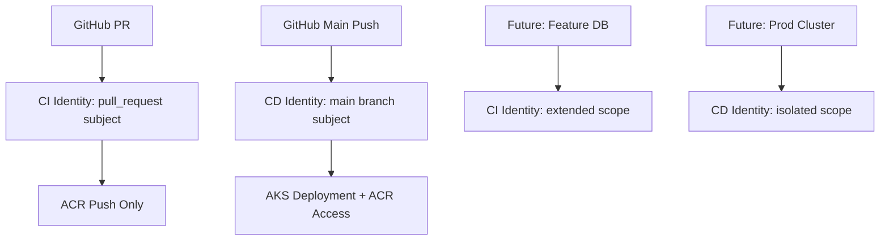

# Azure AKS Version of Course Project #

## Setting up Azure PostgreSQL Flexible Server (DBaaS)

### Production and Feature Environments

- **Production server:**
  - Name: `kubemooc-postgres-prod`
  - Location: `northeurope`
  - SKU: `Standard_B1ms` (Burstable, low-cost)
  - High Availability: Disabled

- **Feature server:**
  - Name: `kubemooc-postgres-feature`
  - Location: `northeurope`
  - SKU: `Standard_B1ms`
  - High Availability: Disabled

#### Azure CLI Example

```bash
az postgres flexible-server create \
  --resource-group kubernetes-learning \
  --name kubemooc-postgres-prod \
  --location northeurope \
  --sku-name Standard_B1ms \
  --tier Burstable \
  --high-availability Disabled \
  --storage-size 32 \
  --version 16 \
  --admin-user kubemoocadmin \
  --public-access 0.0.0.0 \
  --yes

az postgres flexible-server create \
  --resource-group kubernetes-learning \
  --name kubemooc-postgres-feature \
  --location northeurope \
  --sku-name Standard_B1ms \
  --tier Burstable \
  --high-availability Disabled \
  --storage-size 32 \
  --version 16 \
  --admin-user kubemoocadmin \
  --public-access 0.0.0.0 \
  --yes
```

See `.project/context.yaml` for server details. Feature branch automation should create databases on the feature server.

## Exercise 4.1 - Setting up Azure AKS environment ##
### Azure CLI Commands ###
Installing Azure CLI on macOS:
```bash
brew install azure-cli
```

```bash
Logging in to Azure:
```bash
az login
```

Checking the account:
```bash
az account show
```

Creating a resource group
```bash
az group create --name <RESOURCE_GROUP_NAME> --location <AZURE_REGION>
```

### Setting up AKS Cluster ###
Creating an AKS cluster:
```bash
az aks create --resource-group <RESOURCE_GROUP_NAME> --name <AKS_CLUSTER_NAME> --node-count 1 --enable-addons monitoring --generate-ssh-keys
```

## #Connecting Kubectl to AKS ###
```bash
az aks get-credentials --resource-group <RESOURCE_GROUP_NAME> --name <AKS_CLUSTER_NAME>
```

Checking the connection:
```bash
kubectl get nodes
```bash
kubectl get nodes
```

Switching between local context and AKS context:
```bash
kubectl config get-contexts
kubectl config use-context <context-name>
```

# Setting up Azure COntainer Registry (ACR) #

Docs are here: https://learn.microsoft.com/en-us/azure/aks/cluster-container-registry-integration?tabs=azure-cli

Creating an ACR:
```bash
az acr create --resource-group <RESOURCE_GROUP_NAME> --name <ACR_NAME> --sku Basic
```

## Attaching ACR to AKS ##
```bash
az aks update --name <AKS_CLUSTER_NAME> --resource-group <RESOURCE_GROUP_NAME> --attach-acr <ACR_NAME>
```

**Note: Might have to do from the GUI**

## Pushing images to ACR ##
Logging in to ACR:
```bash
az acr login --name <ACR_NAME>
```

Tagging the image:
```bash
docker tag ping-pong-app:3.1 <ACR_NAME>.azurecr.io/ping-pong-app:3.1
```

Pushing the image to ACR:
```bash
docker push <ACR_NAME>.azurecr.io/ping-pong-app:3.1
```

## Manifest changes for Azure AKS ##

### Postgres StatefulSet ###
Change the `storageClassName` from `local-path` to `managed-csi` because the original storage type isn't available in Azure Kubernetes Service, which causes the database pod's storage request to fail. This fix allows Kubernetes to use a valid class that automatically provisions a persistent Azure Disk, enabling the PostgreSQL pod to start correctly.

```yaml
spec:
  volumeClaimTemplates:
    - metadata:
        name: postgres-data-storage
      spec:
        accessModes: ["ReadWriteOnce"]
        storageClassName: managed-csi # Changed from local-path to managed-csi
        resources:
          requests:
            storage: 100Mi
```

Add the `subPath` property to the database's volume mount because the PostgreSQL startup script requires a completely empty directory for initialization, and the root of the persistent disk is not empty (it contains a lost+found). This one-line change in the StatefulSet manifest mounts a clean subdirectory from the disk instead, allowing the database to initialize and start successfully.
```yaml
volumeMounts:
    - name: postgres-data-storage
        mountPath: /var/lib/postgresql/data
        subPath: postgres # Added subPath to ensure a clean directory for PostgreSQL initialization
```

More info here: https://learn.microsoft.com/en-us/azure/aks/azure-csi-disk-storage-provision

# Docker changes #
The AKS does not support mac or Windows images, so we need to build the image on a Linux machine. The Dockerfile is already set up for that. Command to explicitly build the image for Linux:
```bash
docker build --platform linux/amd64 -t log-output-app:3.1 .
```

After that the app needs to be tagged:
```bash
docker tag log-output-app:3.1 <ACR_NAME>.azurecr.io/log-output-app:3.1
```

And then pushed to the ACR:
```bash
docker push <ACR_NAME>.azurecr.io/log-output-app:3.1
```

Command to check the tags of the images in the ACR:
```bash
az acr repository show-tags --name <ACR_NAME> --repository log-output-app --output table
```

### Enabling AKS App Routing for Ingress ###
To enable AKS App Routing, you need to create an App Routing add-on. This will allow you to use the Azure Application Gateway for ingress traffic management.

See Microsoft Learn documentation for details: https://learn.microsoft.com/en-us/azure/aks/app-routing

- AKS requires manual ingress controller setup (GKE has it built-in)
- App Routing add-on provides managed NGINX ingress controller
- Ingress resource must reference the correct ingress class to be processed
- External IP provisioning takes 2-3 minutes after proper configuration

```bash
az aks approuting enable --resource-group <RESOURCE_GROUP_NAME> --name <AKS_CLUSTER_NAME>
```

Check app routing status:
```bash
kubectl get pods -n app-routing-system
```

Check available ingressClass:
```bash
kubectl get ingressclass
```

The deployed ingressClass has to bereferenced in the Ingress manifest. Update the Ingress manifest to use the Azure Application Gateway ingress class:
```yaml
spec:
  ingressClassName: webapprouting.kubernetes.azure.com
```
Get the ingress IP address:
```bash
kubectl get ingress
```

# Azure Workload Identity for GitHub Actions CI/CD

## Provisioning Function Managed Identity Setup (August 14, 2025)

### Azure Function Environment Provisioning

For the **kubemooc-provisioning-func** Azure Function, we created a dedicated managed identity `mi-provisioning-function` with the following role assignments to support automated environment provisioning:

#### Required Role Assignments for mi-provisioning-function

```bash
# Get the managed identity principal ID
IDENTITY_PRINCIPAL_ID=$(az identity show --name mi-provisioning-function --resource-group <AUTOMATION_RESOURCE_GROUP> --query principalId -o tsv)

# PostgreSQL Database Management
az role assignment create \
  --assignee $IDENTITY_PRINCIPAL_ID \
  --role "Contributor" \
  --scope "/subscriptions/<AZURE_SUBSCRIPTION_ID>/resourceGroups/<POSTGRES_RESOURCE_GROUP>/providers/Microsoft.DBforPostgreSQL/flexibleServers/<POSTGRES_SERVER_NAME>"

# Managed Identity Operations (for federated credential management)
az role assignment create \
  --assignee $IDENTITY_PRINCIPAL_ID \
  --role "Managed Identity Operator" \
  --scope "/subscriptions/<AZURE_SUBSCRIPTION_ID>/resourceGroups/<AUTOMATION_RESOURCE_GROUP>/providers/Microsoft.ManagedIdentity/userAssignedIdentities/<APP_MANAGED_IDENTITY_NAME>"

az role assignment create \
  --assignee $IDENTITY_PRINCIPAL_ID \
  --role "Managed Identity Contributor" \
  --scope "/subscriptions/<AZURE_SUBSCRIPTION_ID>/resourceGroups/<AUTOMATION_RESOURCE_GROUP>/providers/Microsoft.ManagedIdentity/userAssignedIdentities/<APP_MANAGED_IDENTITY_NAME>"

# AKS Cluster Access (for namespace creation and OIDC issuer access)
az role assignment create \
  --assignee $IDENTITY_PRINCIPAL_ID \
  --role "Reader" \
  --scope "/subscriptions/<AZURE_SUBSCRIPTION_ID>/resourceGroups/<AKS_RESOURCE_GROUP>/providers/Microsoft.ContainerService/managedClusters/<AKS_CLUSTER_NAME>"

az role assignment create \
  --assignee $IDENTITY_PRINCIPAL_ID \
  --role "Azure Kubernetes Service RBAC Writer" \
  --scope "/subscriptions/<AZURE_SUBSCRIPTION_ID>/resourceGroups/<AKS_RESOURCE_GROUP>/providers/Microsoft.ContainerService/managedClusters/<AKS_CLUSTER_NAME>"
```

#### Function Environment Variables

The provisioning function requires these environment variables to be set in the Azure Function App configuration:

```bash
AZURE_SUBSCRIPTION_ID=<YOUR_AZURE_SUBSCRIPTION_ID>
POSTGRES_RESOURCE_GROUP=<POSTGRES_RESOURCE_GROUP>
POSTGRES_SERVER_NAME=<POSTGRES_SERVER_NAME>
POSTGRES_ADMIN_USER=<POSTGRES_ADMIN_USER>
POSTGRES_ADMIN_PASSWORD=<stored-in-azure-portal>
MANAGED_IDENTITY_RESOURCE_GROUP=<AUTOMATION_RESOURCE_GROUP>
MANAGED_IDENTITY_NAME=<APP_MANAGED_IDENTITY_NAME>
MANAGED_IDENTITY_CLIENT_ID=<APP_MANAGED_IDENTITY_CLIENT_ID>
AKS_RESOURCE_GROUP=<AKS_RESOURCE_GROUP>
AKS_CLUSTER_NAME=<AKS_CLUSTER_NAME>
```

**Note**: All actual values are stored in `.project/context.yaml` and should not be committed to version control.

#### Function Capabilities

The deployed function creates complete branch environments with a single HTTP POST:

1. **PostgreSQL Database**: Creates branch-specific database on shared server
2. **Federated Credential**: Sets up workload identity for branch namespace 
3. **Kubernetes Namespace**: Creates namespace with AGC gateway access labels

**Function URL**: `https://<FUNCTION_APP_NAME>.azurewebsites.net/api/provision`

**Usage**:
```bash
curl -X POST \
  -H "Content-Type: application/json" \
  -d '{"branch_name": "feature-xyz"}' \
  "https://<FUNCTION_APP_NAME>.azurewebsites.net/api/provision?code=<function-key>"
```

## Deployment Function Managed Identity Setup (August 15, 2025)

### Azure Function for Feature Branch Deployment

For the **kubemooc-deployment-func** Azure Function, we created a dedicated managed identity `mi-deployment-function` with the following role assignments to support automated feature branch deployment to AKS:

#### Required Resources Created

```bash
# Function App Details
DEPLOYMENT_FUNCTION_NAME="kubemooc-deployment-func"
DEPLOYMENT_STORAGE_ACCOUNT="kubemoocdeploymentst"
DEPLOYMENT_APP_INSIGHTS="kubemooc-deployment-func"
DEPLOYMENT_HOSTING_PLAN="ASP-kubemoocautomationrg-80da"

# Managed Identity
DEPLOYMENT_IDENTITY_NAME="mi-deployment-function"
AUTOMATION_RESOURCE_GROUP="kubemooc-automation-rg"
```

#### Step 1: Gather Required Resource Information

```bash
# Get the deployment function managed identity details
DEPLOYMENT_IDENTITY_CLIENT_ID=$(az identity show --name ${DEPLOYMENT_IDENTITY_NAME} --resource-group ${AUTOMATION_RESOURCE_GROUP} --query clientId -o tsv)
DEPLOYMENT_IDENTITY_PRINCIPAL_ID=$(az identity show --name ${DEPLOYMENT_IDENTITY_NAME} --resource-group ${AUTOMATION_RESOURCE_GROUP} --query principalId -o tsv)
DEPLOYMENT_IDENTITY_RESOURCE_ID=$(az identity show --name ${DEPLOYMENT_IDENTITY_NAME} --resource-group ${AUTOMATION_RESOURCE_GROUP} --query id -o tsv)

echo "Deployment Identity Client ID: ${DEPLOYMENT_IDENTITY_CLIENT_ID}"
echo "Deployment Identity Principal ID: ${DEPLOYMENT_IDENTITY_PRINCIPAL_ID}"
echo "Deployment Identity Resource ID: ${DEPLOYMENT_IDENTITY_RESOURCE_ID}"

# Get ACR resource ID for permission assignment
ACR_RESOURCE_ID=$(az acr show --name kubemooc --resource-group kubernetes-learning --query id -o tsv)
echo "ACR Resource ID: ${ACR_RESOURCE_ID}"

# Get AKS resource ID for permission assignment  
AKS_RESOURCE_ID=$(az aks show --name kube-mooc --resource-group kubernetes-learning --query id -o tsv)
echo "AKS Resource ID: ${AKS_RESOURCE_ID}"
```

#### Step 2: Assign Required Permissions to mi-deployment-function

```bash
# ACR Pull Permission (for image verification)
az role assignment create \
  --assignee $DEPLOYMENT_IDENTITY_PRINCIPAL_ID \
  --scope $ACR_RESOURCE_ID \
  --role "7f951dda-4ed3-4680-a7ca-43fe172d538d"  # AcrPull role ID

echo "✅ Assigned AcrPull permission to ACR"

# AKS Contributor Permission (for cluster operations)
az role assignment create \
  --assignee $DEPLOYMENT_IDENTITY_PRINCIPAL_ID \
  --scope $AKS_RESOURCE_ID \
  --role "ed7f3fbd-7b88-4dd4-9017-9adb7ce333f8"  # Azure Kubernetes Service Contributor Role ID

echo "✅ Assigned AKS Contributor permission"

# AKS RBAC Writer Permission (for Kubernetes resource management)
az role assignment create \
  --assignee $DEPLOYMENT_IDENTITY_PRINCIPAL_ID \
  --scope $AKS_RESOURCE_ID \
  --role "a7ffa36f-339b-4b5c-8bdf-e2c188b2c0eb"  # Azure Kubernetes Service RBAC Writer role ID

echo "✅ Assigned AKS RBAC Writer permission"
```

#### Step 3: Verify Permission Assignments

```bash
# Verify all role assignments for the deployment function identity
az role assignment list --assignee $DEPLOYMENT_IDENTITY_PRINCIPAL_ID --output table

# Expected output should show:
# - AcrPull on kubemooc ACR
# - Azure Kubernetes Service Contributor Role on kube-mooc AKS cluster  
# - Azure Kubernetes Service RBAC Writer on kube-mooc AKS cluster
```

#### Step 4: Assign Managed Identity to Function App

```bash
# Assign the user-assigned managed identity to the function app
az functionapp identity assign \
  --name $DEPLOYMENT_FUNCTION_NAME \
  --resource-group $AUTOMATION_RESOURCE_GROUP \
  --identities $DEPLOYMENT_IDENTITY_RESOURCE_ID

echo "✅ Assigned managed identity to function app"
```

#### Function Environment Variables

The deployment function requires these environment variables to be set in the Azure Function App configuration:

```bash
# Core Azure Resources
AZURE_SUBSCRIPTION_ID=ede18d8a-a758-4a40-b15e-6eded5264b93
ACR_LOGIN_SERVER=kubemooc.azurecr.io
ACR_NAME=kubemooc
AKS_CLUSTER_NAME=kube-mooc
AKS_RESOURCE_GROUP=kubernetes-learning

# Managed Identity Authentication
DEPLOYMENT_FUNCTION_IDENTITY_NAME=mi-deployment-function
DEPLOYMENT_FUNCTION_CLIENT_ID=${DEPLOYMENT_IDENTITY_CLIENT_ID}

# GitHub Repository Access (public repository)
GITHUB_REPOSITORY_URL=https://github.com/rjpalt/KubernetesMOOC.git
```

#### Function Capabilities

The deployed function will handle feature branch deployment with a single HTTP POST:

1. **Image Verification**: Confirms tested images exist in ACR with correct tags
2. **Kubernetes Manifests**: Downloads and processes manifests from GitHub repository
3. **Namespace Deployment**: Deploys to pre-provisioned feature namespaces
4. **Health Verification**: Validates deployment success and service readiness

**Function URL**: `https://kubemooc-deployment-func-<random>.northeurope-01.azurewebsites.net/api/deploy`

**Usage**:
```bash
curl -X POST \
  -H "Content-Type: application/json" \
  -d '{ "branch_name": "feature-xyz", "commit_sha": "abc123" }' \
  "https://kubemooc-deployment-func-<random>.northeurope-01.azurewebsites.net/api/deploy?code=<function-key>"
```

**Expected Response**:
```json
{
  "status": "success",
  "branch_name": "feature-xyz",
  "namespace": "feature-feature-xyz",
  "deployment_url": "https://feature-xyz.23.98.101.23.nip.io/",
  "health_checks": {
    "backend": "healthy",
    "frontend": "healthy"
  },
  "message": "Feature environment deployed successfully"
}
```

#### Security Benefits of Separate Identities

- **Principle of Least Privilege**: Each function has only the permissions it needs
- **Separation of Concerns**: Provisioning vs Deployment responsibilities clearly defined
- **Audit Trail**: Clear tracking of which function performed which operations
- **Blast Radius Limitation**: Compromise of one identity doesn't affect the other

**Note**: All actual values are stored in `.project/context.yaml` and should not be committed to version control.

## Why Separate Identities for CI and CD?

In production environments, it's crucial to follow the **principle of least privilege** and separate concerns between different pipeline stages, even when they share the same underlying infrastructure.

### Security Benefits

1. **Blast Radius Limitation**: If CI identity is compromised, it can only push images, not deploy to production
2. **Permission Scoping**: Each identity has only the minimum permissions needed for its specific role
3. **Audit Trail**: Clear separation of who did what in CI vs CD stages
4. **Future Flexibility**: Ready for infrastructure evolution (separate test databases, staging clusters)

### Current Architecture

Even though our feature and production environments currently share the same AKS cluster and ACR, separate identities provide:
- **CI Identity**: Only ACR push permissions for building and storing tested images
- **CD Identity**: AKS deployment permissions for production releases
- **Clean Separation**: CI focuses on build/test, CD focuses on deployment

## Creating Azure Managed Identities for GitHub Actions

### CI Identity Setup

```bash
# Create dedicated CI identity for build and push operations
az identity create \
  --name github-actions-ci \
  --resource-group <RESOURCE_GROUP_NAME> \
  --location <AZURE_REGION>

# Grant ACR push permissions (minimal needed for CI)
az role assignment create \
  --assignee $(az identity show -g <RESOURCE_GROUP_NAME> -n github-actions-ci --query clientId -o tsv) \
  --role AcrPush \
  --scope $(az acr show --name <ACR_NAME> --query id --output tsv)

# Create federated credential for pull requests
az identity federated-credential create \
  --name github-actions-ci \
  --identity-name github-actions-ci \
  --resource-group <RESOURCE_GROUP_NAME> \
  --issuer https://token.actions.githubusercontent.com \
  --subject repo:<GITHUB_USERNAME>/<GITHUB_REPO>:pull_request \
  --audience api://AzureADTokenExchange
```

### CD Identity Setup (Existing)

```bash
# CD identity already exists with broader permissions
# Originally created with:
az identity create \
  --name github-actions-todo-cd \
  --resource-group <RESOURCE_GROUP_NAME> \
  --location <AZURE_REGION>

# Has AKS deployment permissions + ACR access
# Federated credential for main branch only:
az identity federated-credential create \
  --name github-actions-ci-cd \
  --identity-name github-actions-todo-cd \
  --resource-group <RESOURCE_GROUP_NAME> \
  --issuer https://token.actions.githubusercontent.com \
  --subject repo:<GITHUB_USERNAME>/<GITHUB_REPO>:ref:refs/heads/main \
  --audience api://AzureADTokenExchange
```

## Federated Credential Subject Scoping

### Understanding GitHub OIDC Subjects

The `subject` field in federated credentials determines **exactly when** Azure will trust the GitHub token:

#### Pull Request Subject: `repo:owner/repo:pull_request`
- **Scope**: ANY pull request to ANY branch
- **Use Case**: CI pipelines that run on feature branches
- **Security**: Broader scope but limited permissions (only ACR push)
- **Trigger**: `on: pull_request` in GitHub Actions

#### Branch-Specific Subject: `repo:owner/repo:ref:refs/heads/main`
- **Scope**: ONLY pushes to the main branch
- **Use Case**: Production deployments after PR merge
- **Security**: Narrow scope with broader permissions (AKS deployment)
- **Trigger**: `on: push: branches: [main]` in GitHub Actions

### Subject Scoping Implications

| Subject Type | When It Triggers | Security Posture | Use Case |
|--------------|------------------|------------------|-----------|
| `pull_request` | Any PR to any branch | Wider trigger scope, minimal permissions | CI builds/tests |
| `ref:refs/heads/main` | Only main branch pushes | Narrow trigger scope, full permissions | Production deployment |
| `ref:refs/heads/feature/*` | Only specific feature branches | Very narrow scope | Branch-specific testing |

### Architecture Benefits



### GitHub Secrets Configuration

```bash
# Set CI identity for pull request builds
gh secret set AZURE_CI_CLIENT_ID --body "<CI_MANAGED_IDENTITY_CLIENT_ID>"

# CD identity remains for production deployments
# AZURE_CLIENT_ID = "<CD_MANAGED_IDENTITY_CLIENT_ID>"
```

-----

# Deploying an Application to Azure Kubernetes Service (AKS) with Application Gateway for Containers

## Introduction

This tutorial provides a comprehensive walkthrough for deploying the Azure Application Gateway for Containers (ALB) and using it to expose a sample application via the Kubernetes Gateway API. This guide is intended for students and developers who want a detailed, step-by-step process that includes not only the "how" but also the "why" for each major action.

A quick note on complexity: if you are familiar with this process on other cloud platforms like Google Kubernetes Engine (GKE), you may notice that the Azure setup involves more explicit steps. This is because Azure's security model requires the user to manually provision and configure the underlying networking (VNet, subnets) and identity components (Managed Identity, role assignments). While this requires more initial setup, it provides granular control over your cloud architecture.

We will cover five main phases:

1.  **Preparing the AKS Cluster and Azure Identity**: We will configure the AKS cluster with the necessary features for secure communication with Azure and create a dedicated identity for the ALB controller.
2.  **Installing the ALB Controller**: We will deploy the controller software into our Kubernetes cluster using Helm.
3.  **Configuring Azure Networking**: We will prepare our virtual network by creating and delegating a dedicated subnet for the Application Gateway resources.
4.  **Provisioning the Gateway Resources**: We will instruct the controller to provision the Application Gateway infrastructure in Azure and define our traffic entry point using the Gateway API.
5.  **Deploying and Exposing a Sample Application**: We will deploy a sample application and use an `HTTPRoute` resource to make it accessible through our new gateway.

-----

## Phase 1: Cluster and Identity Preparation

In this phase, we'll set up the foundational components. We will enable Workload Identity on our AKS cluster and create a specific Managed Identity for the ALB controller to use when interacting with Azure APIs.

### 1.1. Set Environment Variables

First, define some environment variables for your resource group and AKS cluster name to make subsequent commands easier to run and read.

```bash
RESOURCE_GROUP='<RESOURCE_GROUP_NAME>'
AKS_NAME='<AKS_CLUSTER_NAME>'
```

### 1.2. Enable AKS Features for Workload Identity

We need to enable two key features on the AKS cluster.

  * **OIDC Issuer**: OIDC (OpenID Connect) is an authentication standard. By enabling it, we turn our AKS cluster's API server into a trusted **issuer** of security tokens. It can now vouch for the identity of workloads running inside it.
  * **Workload Identity**: This is the feature that uses the OIDC tokens. It allows a Kubernetes **workload** (a pod) to exchange its native Kubernetes token for an Azure Active Directory (AD) token.

**Why we do this**: This entire mechanism enables secure, passwordless access to Azure. The pod proves its identity to Azure using a trusted token from Kubernetes, eliminating the need to store and manage sensitive credentials like client secrets inside the cluster.

```bash
az aks update -g $RESOURCE_GROUP -n $AKS_NAME --enable-oidc-issuer --enable-workload-identity --no-wait
```

### 1.3. Create a Managed Identity for the ALB Controller

A **Managed Identity** is an identity in Azure AD that is automatically managed by Azure. Think of it as a service account for an Azure resource or application. It eliminates the need for developers to manage credentials because authentication is handled seamlessly in the background. We create a User-Assigned Managed Identity that the ALB controller will use to act on our behalf.

```bash
IDENTITY_RESOURCE_NAME='azure-alb-identity'

az identity create --resource-group $RESOURCE_GROUP --name $IDENTITY_RESOURCE_NAME
```

### 1.4. Grant the Identity Initial Permissions

The ALB controller needs to be able to see the resources within the AKS node resource group. We'll grant it the `Reader` role.

**Why is the `Reader` role enough here?** Following the principle of least privilege, we grant only the permissions needed at each stage. At this point, the controller only needs to read information about the cluster's resources. We will grant more powerful permissions, like the ability to modify networking, later when they are specifically required.

First, get the resource group ID for the AKS nodes (this is auto-generated by AKS and usually prefixed with `MC_`). Then, get the Principal ID of the identity we just created.

```bash
mcResourceGroup=$(az aks show --resource-group $RESOURCE_GROUP --name $AKS_NAME --query "nodeResourceGroup" -o tsv)
mcResourceGroupId=$(az group show --name $mcResourceGroup --query id -otsv)
principalId="$(az identity show -g $RESOURCE_GROUP -n $IDENTITY_RESOURCE_NAME --query principalId -otsv)"
```

Now, create the role assignment. We use the unique ID for the "Reader" role here.

```bash
az role assignment create --assignee-object-id $principalId --assignee-principal-type ServicePrincipal --scope $mcResourceGroupId --role "acdd72a7-3385-48ef-bd42-f606fba81ae7"
```

### 1.5. Establish a Federated Credential Trust

This is the final step in setting up Workload Identity. We create a trust relationship between a specific Kubernetes Service Account (which the ALB controller will use) and the Azure Managed Identity we created. This tells Azure to trust tokens issued by our Kubernetes cluster for that service account.

```bash
AKS_OIDC_ISSUER="$(az aks show -n "$AKS_NAME" -g "$RESOURCE_GROUP" --query "oidcIssuerProfile.issuerUrl" -o tsv)"

az identity federated-credential create --name "azure-alb-identity" \
    --identity-name "$IDENTITY_RESOURCE_NAME" \
    --resource-group $RESOURCE_GROUP \
    --issuer "$AKS_OIDC_ISSUER" \
    --subject "system:serviceaccount:azure-alb-system:alb-controller-sa"
```

-----

## Phase 2: Installing the ALB Controller

With the identity and cluster prepared, we can now install the ALB controller software into our cluster. This controller is the "brain" that runs inside Kubernetes, watching for custom resources that define how traffic should be managed.

### 2.1. Set Namespace Variables

**Why do we need namespaces?** Kubernetes namespaces provide a way to create logical partitions within a cluster. They are used to organize resources, prevent naming conflicts, and apply access controls. We will create a dedicated `azure-alb-system` namespace to keep the ALB components isolated from our own applications.

```bash
HELM_NAMESPACE='azure-alb-system'
CONTROLLER_NAMESPACE='azure-alb-system'
```

### 2.2. Configure kubectl

**Why do we need to configure `kubectl` (again)?** The `kubeconfig` file on your local machine stores cluster connection details, including authentication tokens which can expire over time. Running `az aks get-credentials` ensures your connection information is fresh and your token is valid before you begin interacting with the cluster.

```bash
az aks get-credentials --resource-group $RESOURCE_GROUP --name $AKS_NAME
```

### 2.3. Create the Namespace

Create the dedicated namespace in Kubernetes where the controller and its components will reside.

```bash
kubectl create namespace $HELM_NAMESPACE
```

### 2.4. Install the Controller with Helm

We use Helm, the package manager for Kubernetes, to install the ALB controller.

**What does Helm do under the hood?** When you run `helm install`, it performs several actions:

1.  It fetches a **chart**, which is a package of pre-configured Kubernetes YAML templates for the application (in this case, ALB).
2.  It uses the values from the `--set` flags to fill in variables within those templates (e.g., injecting the Client ID of our managed identity).
3.  It renders the final YAML manifests for all the necessary Kubernetes resources, such as the `Deployment` for the controller pods, a `ServiceAccount` for them to use, and the `ClusterRoles` and `ClusterRoleBindings` that grant them permissions within Kubernetes.
4.  It sends these final manifests to the Kubernetes API server to create the resources.
5.  It tracks all these created resources as a single "release," making it easy to manage, upgrade, or uninstall them later.

<!-- end list -->

```bash
helm install alb-controller oci://mcr.microsoft.com/application-lb/charts/alb-controller \
     --namespace $HELM_NAMESPACE \
     --version 1.7.9 \
     --set albController.namespace=$CONTROLLER_NAMESPACE \
     --set albController.podIdentity.clientID=$(az identity show -g $RESOURCE_GROUP -n azure-alb-identity --query clientId -o tsv)
```

### 2.5. Verify the Controller Pods

Check that the controller pods are running successfully in the cluster.

```bash
kubectl get pods -n $HELM_NAMESPACE
```

You should see two pods with a status of `Running`.

-----

## Phase 3: Configuring Azure Networking

**Why do we need to set up networking?** The ALB Controller runs inside Kubernetes (the control plane), but the Application Gateway itself is a managed Azure service that processes traffic (the data plane). We need to prepare a place in our Azure Virtual Network for this data plane to live.

**Why a dedicated subnet?** Creating a separate subnet for the ALB provides critical **isolation**. It prevents IP address conflicts with your AKS nodes and allows you to apply different Network Security Group rules to your ingress traffic than to your cluster nodes. Furthermore, the ALB service requires a special permission on its subnet called a **delegation**, and dedicating a subnet ensures this delegation doesn't interfere with other resources.

**What is the architectural impact?** This creates a clear separation of concerns. The ALB lives in its own dedicated network segment, acting as a secure, managed entry point. It is controlled by Kubernetes resources but is not mixed in with the application node pools.

### 3.1. Get VNet Information

First, we need to identify the Virtual Network (VNet) that our AKS cluster is using.

```bash
VNET_NAME=$(az network vnet list --resource-group $mcResourceGroup --query "[0].name" -o tsv)
VNET_RESOURCE_GROUP=$mcResourceGroup
```

### 3.2. Create a Dedicated Subnet for the ALB

Now, we will create the new subnet. This process involves first inspecting the network to find a valid, unused IP address range.

**Understanding IP Ranges (CIDR Notation)**: IP ranges are defined using CIDR notation, like `10.224.0.0/12`. The number after the `/` indicates how many bits of the IP address are fixed as the network prefix. A smaller number (like `/12`) means a larger network with more available IPs, while a larger number (like `/24`) means a smaller network.

Let's find the address space of your VNet.

```bash
az network vnet show --resource-group $VNET_RESOURCE_GROUP --name $VNET_NAME --query "addressSpace.addressPrefixes" -o tsv
```

Let's assume the output is `10.224.0.0/12`. A `/12` prefix means the first 12 bits are fixed. The IP address `10.224.0.0` in binary starts with `00001010.1110...`. The `/12` boundary is within the second octet. The range of this second octet is from `11100000` (224) to `11101111` (239). Therefore, the full IP range for this VNet is **`10.224.0.0` to `10.239.255.255`**. Any subnet we create must fall within this range.

Next, list existing subnets to ensure the range you pick is not already in use.

```bash
az network vnet subnet list --resource-group $VNET_RESOURCE_GROUP --vnet-name $VNET_NAME --query "[].{Name:name, Prefix:addressPrefix}" -o table
```

Based on the output, choose an unused `/24` CIDR block and create the new subnet. The `--delegations` flag is mandatory.

```bash
ALB_SUBNET_NAME='subnet-alb'
SUBNET_ADDRESS_PREFIX='10.226.0.0/24' # Example: Change if this range is in use

az network vnet subnet create \
  --resource-group $VNET_RESOURCE_GROUP \
  --vnet-name $VNET_NAME \
  --name $ALB_SUBNET_NAME \
  --address-prefixes $SUBNET_ADDRESS_PREFIX \
  --delegations 'Microsoft.ServiceNetworking/trafficControllers'
```

### 3.3. Delegate Final Permissions

The ALB identity needs two more permissions to manage the gateway and join the new subnet.

```bash
ALB_SUBNET_ID=$(az network vnet subnet show --name $ALB_SUBNET_NAME --resource-group $VNET_RESOURCE_GROUP --vnet-name $VNET_NAME --query id --output tsv)

# Delegate role to manage the gateway resource itself
az role assignment create --assignee-object-id $principalId --assignee-principal-type ServicePrincipal --scope $mcResourceGroupId --role "fbc52c3f-28ad-4303-a892-8a056630b8f1"

# Delegate role to join the subnet
az role assignment create --assignee-object-id $principalId --assignee-principal-type ServicePrincipal --scope $ALB_SUBNET_ID --role "4d97b98b-1d4f-4787-a291-c67834d212e7"
```

-----

## Phase 4: Provisioning the Gateway Resources

Now we instruct the controller to create the Application Gateway infrastructure and define our traffic entrypoint.

### 4.1. Create the ApplicationLoadBalancer Resource

We will now create a Kubernetes resource of `kind: ApplicationLoadBalancer`. When the ALB controller sees this, it will start provisioning the actual gateway in Azure. We will create this resource in a new namespace, `nsa2`.

First, create the namespace.

```bash
kubectl create namespace nsa2
```

Now, create a YAML file named `nsa2-alb.yaml`. The `tee` command is a convenient way to do this from the shell. Note that `spec.associations` points to the ID of the subnet we just created.

```bash
ALB='default-alb'

tee nsa2-alb.yaml > /dev/null <<EOF
apiVersion: alb.networking.azure.io/v1
kind: ApplicationLoadBalancer
metadata:
  name: $ALB
  namespace: nsa2
spec:
  associations:
  - $ALB_SUBNET_ID
EOF
```

Apply the manifest to the cluster.

```bash
kubectl apply -f nsa2-alb.yaml
```

### 4.2. Verify the ApplicationLoadBalancer Provisioning

This provisioning step can take a few minutes. You can watch its status until the `reason` for the `Deployment` type becomes `Ready`.

```bash
kubectl -n nsa2 get applicationloadbalancer default-alb -o yaml -w
```

Press `Ctrl + C` to exit once you see the `Ready` status.

### 4.3. Create the Gateway Resource

With the infrastructure ready, we can now create a standard Kubernetes `Gateway` resource. This defines the listener for our traffic.

Create a file named `k8s-nsa2-gateway.yaml`:

```yaml
apiVersion: gateway.networking.k8s.io/v1
kind: Gateway
metadata:
  name: k8s-nsa2-gateway
  namespace: nsa2
spec:
  gatewayClassName: azure-alb-external
  listeners:
    - name: http
      protocol: HTTP
      port: 80
      allowedRoutes:
        namespaces:
          from: Same
```

Apply the manifest:

```bash
kubectl apply -f k8s-nsa2-gateway.yaml
```

### 4.4. Get the Gateway's Public Address

The Application Gateway will be assigned a public Fully Qualified Domain Name (FQDN). Retrieve it and store it in a variable.

```bash
fqdn=$(kubectl get gateway k8s-nsa2-gateway -n nsa2 -o jsonpath='{.status.addresses[0].value}')
echo $fqdn
```

-----

## Phase 5: Deploying and Exposing a Sample Application

Finally, we deploy a sample web app and use an `HTTPRoute` to connect it to our gateway.

### 5.1. Deploy and Expose the Application

Create an Nginx deployment and expose it internally with a `ClusterIP` Service.

```bash
# Create the deployment
kubectl create deployment nsa2-webapp --image=nginx:latest -n nsa2

# Create the service
kubectl expose deployment nsa2-webapp --port=80 --type=ClusterIP -n nsa2
```

### 5.2. Create the HTTPRoute

The `HTTPRoute` resource tells the gateway how to route incoming traffic. It links the gateway (`parentRefs`) to a backend service (`backendRefs`).

Create a file named `nsa2-webapp-route.yaml`:

```yaml
apiVersion: gateway.networking.k8s.io/v1
kind: HTTPRoute
metadata:
  name: nsa2-webapp-route
  namespace: nsa2
spec:
  parentRefs:
    - name: k8s-nsa2-gateway
  rules:
    - matches:
        - path:
            type: PathPrefix
            value: "/"
      backendRefs:
        - name: nsa2-webapp
          kind: Service
          port: 80
```

Apply the manifest:

```bash
kubectl apply -f nsa2-webapp-route.yaml
```

-----

## Phase 6: Verification

Your application should now be accessible to the internet. You can test it by opening the gateway's public address in your browser or by using a command-line tool like `curl`.

```bash
curl http://$fqdn
```

You should see the "Welcome to nginx\!" default page.

## Custom Health Checks for ALB ##

### Troubleshooting "no healthy upstream" Error

When using Azure Application Gateway for Containers, you may encounter the error "no healthy upstream" when trying to access your application through HTTPRoute. This error indicates that the ALB Controller considers your backend service unhealthy.

**Root Cause:**
By default, Azure ALB performs health checks on the root path (`/`) of your backend services. If your application doesn't implement a root endpoint or returns a non-2xx status code, the ALB marks it as unhealthy and refuses to route traffic to it.

**Diagnostic Steps:**
1. **Verify service health directly**: Test your service endpoints within the cluster
   ```bash
   kubectl run test-pod --image=busybox --rm -it --restart=Never -n exercises -- wget -qO- http://your-service:port/
   kubectl run test-pod --image=busybox --rm -it --restart=Never -n exercises -- wget -qO- http://your-service:port/health
   ```

2. **Check ALB Controller logs**: Look for health check failures
   ```bash
   kubectl logs -n azure-alb-system -l app=alb-controller --tail=100 | grep -i health
   ```

**Solution: Custom Health Check Policy**
Create a `HealthCheckPolicy` resource to specify a custom health check endpoint for services that don't implement the root path:

```yaml
apiVersion: alb.networking.azure.io/v1
kind: HealthCheckPolicy
metadata:
  name: ping-pong-health-check
  namespace: exercises
spec:
  targetRef:
    group: ""
    kind: Service
    name: ping-pong-svc
  default:
    interval: 5s
    timeout: 2s
    unhealthyThreshold: 3
    healthyThreshold: 2
    http:
      path: "/health"
```

This policy tells the ALB Controller to use `/health` instead of `/` for health checks on the specified service.

**References:**
- [Google Cloud troubleshooting guide](https://cloud.google.com/kubernetes-engine/docs/how-to/deploying-gateways#no-healthy-upstream)
- [Azure ALB health probe configuration](https://learn.microsoft.com/en-us/azure/application-gateway/for-containers/custom-health-probe#default-health-probe)

# Setting up Kubernetes to use Azure Key Vault for Secrets Management #

## Resource Discovery
```bash
# Example pattern - you'll need to adapt with your actual values
RESOURCE_GROUP="<RESOURCE_GROUP_NAME>"
AKS_CLUSTER="<AKS_CLUSTER_NAME>"

# Fetch and store cluster info
AKS_RESOURCE_ID=$(az aks show --resource-group $RESOURCE_GROUP --name $AKS_CLUSTER --query id -o tsv)
SUBSCRIPTION_ID=$(az account show --query id -o tsv)

# Echo the values for verification
echo "AKS Resource ID: $AKS_RESOURCE_ID"
echo "Subscription ID: $SUBSCRIPTION_ID"
```

## Identity Management
```bash
IDENTITY_NAME="keyvault-identity-<PROJECT_NAME>"

# Create a Managed Identity for AKS to access Key Vault
az identity create --resource-group $RESOURCE_GROUP --name $IDENTITY_NAME

# Fetch the created identity details
IDENTITY_CLIENT_ID=$(az identity show --resource-group $RESOURCE_GROUP --name $IDENTITY_NAME --query clientId -o tsv)
IDENTITY_PRINCIPAL_ID=$(az identity show --resource-group $RESOURCE_GROUP --name $IDENTITY_NAME --query principalId -o tsv)

# Echo the identity details for verification
echo "Managed Identity Client ID: $IDENTITY_CLIENT_ID"
echo "Managed Identity Principal ID: $IDENTITY_PRINCIPAL_ID"
```

## AKS Cluster Infromation
```bash
# Get the managed cluster resource group (where AKS creates its resources)
MC_RESOURCE_GROUP=$(az aks show --resource-group $RESOURCE_GROUP --name $AKS_CLUSTER --query "nodeResourceGroup" -o tsv)
echo "MC Resource Group: $MC_RESOURCE_GROUP"

# Get the OIDC issuer URL (needed for workload identity)
AKS_OIDC_ISSUER=$(az aks show --resource-group $RESOURCE_GROUP --name $AKS_CLUSTER --query "oidcIssuerProfile.issuerUrl" -o tsv)
echo "OIDC Issuer: $AKS_OIDC_ISSUER"
```

## AKV Creation and Configuration
```bash
KEYVAULT_NAME="kv-<PROJECT_NAME>-$(date +%s)"
echo "Key Vault Name: $KEYVAULT_NAME"
```

Create the Key Vault:
```bash
# Create the Key Vault
az keyvault create \
  --name $KEYVAULT_NAME \
  --resource-group $RESOURCE_GROUP \
  --location <AZURE_REGION> \
  --enable-rbac-authorization

# Get the Key Vault resource ID for future use
KEYVAULT_ID=$(az keyvault show --name $KEYVAULT_NAME --resource-group $RESOURCE_GROUP --query id -o tsv)
echo "Key Vault ID: $KEYVAULT_ID"
```

Assigning yourself permissions into the Key Vault:
```bash
# Check your identity
az account show --query "user.name" -o tsv

# Get your user object ID
USER_OBJECT_ID=$(az ad signed-in-user show --query id -o tsv)

# Assign yourself Key Vault Contributor role
az role assignment create \
  --assignee-object-id $USER_OBJECT_ID \
  --assignee-principal-type User \
  --scope $KEYVAULT_ID \
  --role "Key Vault Secrets Officer"
```


## Storing Postgres Credentials in Key Vault
First go to the fodler with your secrets and check the secrets you have:


Setting the secrets in the Key Vault:
```bash
# Set the Postgres admin user
az keyvault secret set \
  --vault-name $KEYVAULT_NAME \
  --name "postgres-user" \
  --value "$DECODED_USER"

# Set the Postgres admin password
az keyvault secret set \
  --vault-name $KEYVAULT_NAME \
  --name "postgres-password" \
  --value "$DECODED_PASSWORD"

# Verify secrets are set
az keyvault secret list --vault-name $KEYVAULT_NAME --query "[].name" -o table
```

## Granting your AKS Managed Identity Access to Key Vault
```bash
az role assignment create \
  --assignee-object-id $IDENTITY_PRINCIPAL_ID \
  --assignee-principal-type ServicePrincipal \
  --scope $KEYVAULT_ID \
  --role "Key Vault Secrets User"
```

## Taking the secrets from Key Vault in your AKS cluster

### Enable CSI Secrets Store Driver
```bash
az aks enable-addons \
  --addons azure-keyvault-secrets-provider \
  --name $AKS_CLUSTER \
  --resource-group $RESOURCE_GROUP
```

### Workload identity bridging
```bash
# Create a federated credential for the Postgres service account in Azure
az identity federated-credential create \
  --name "postgres-workload-identity" \
  --identity-name $IDENTITY_NAME \
  --resource-group $RESOURCE_GROUP \
  --issuer $AKS_OIDC_ISSUER \
  --subject "system:serviceaccount:project:postgres-service-account"
```

Key concept: The --subject parameter defines exactly which Kubernetes ServiceAccount Azure will trust. The format is system:serviceaccount:NAMESPACE:SERVICE_ACCOUNT_NAME.

### Creating the Service Account and Secret Provider Class

```yaml
apiVersion: v1
kind: ServiceAccount
metadata:
  name: postgres-service-account
  namespace: project
  annotations:
    azure.workload.identity/client-id: <KEYVAULT_MANAGED_IDENTITY_CLIENT_ID>
```

```yaml
apiVersion: secrets-store.csi.x-k8s.io/v1
kind: SecretProviderClass
metadata:
  name: postgres-secret-provider
  namespace: project
spec:
  provider: azure
  parameters:
    usePodIdentity: "false"
    useVMManagedIdentity: "false"
    clientID: "<KEYVAULT_MANAGED_IDENTITY_CLIENT_ID>"
    keyvaultName: "<KEY_VAULT_NAME>"
    tenantId: "<AZURE_TENANT_ID>"
    objects: |
      array:
        - |
          objectName: postgres-user
          objectType: secret
        - |
          objectName: postgres-password
          objectType: secret
  secretObjects:
  - secretName: postgres-secret
    type: Opaque
    data:
    - objectName: postgres-user
      key: USER
    - objectName: postgres-password
      key: PASSWORD

```

provider: azure - Uses the Azure Key Vault provider
clientID - Your managed identity that can access Key Vault
keyvaultName - Which Key Vault to pull from
objects - Lists which secrets to fetch from Key Vault
secretObjects - Creates a Kubernetes secret with the exact name and keys your StatefulSet expects
The critical mapping happens in secretObjects.data:

Key Vault postgres-user becomes Kubernetes secret key USER
Key Vault postgres-password becomes Kubernetes secret key PASSWORD

### Changes to the Postgres StatefulSet
```yaml
      serviceAccountName: postgres-service-account
      volumes:
      - name: secrets-store
        csi:
          driver: secrets-store.csi.k8s.io
          readOnly: true
          volumeAttributes:
            secretProviderClass: "postgres-secret-provider"
          ...
          volumeMounts:
            - name: secrets-store
              mountPath: "/mnt/secrets-store"
              readOnly: true
            - name: postgres-data-storage
              mountPath: /var/lib/postgresql/data
              subPath: postgres
```

Azure Key Vault Integration with AKS - Big Picture Summary
What We Accomplished
Successfully migrated from SOPS-encrypted local secrets to Azure Key Vault integration for the postgres service in our course project.

Architecture Overview

┌─────────────────┐    ┌──────────────────┐    ┌─────────────────┐│   Azure Key     │    │   Kubernetes     │    │   Application   ││     Vault       │◄──►│   CSI Driver     │◄──►│     Pods        ││                 │    │                  │    │                 ││ postgres-user   │    │ postgres-secret  │    │ POSTGRES_USER   ││ postgres-pass   │    │ (K8s Secret)     │    │ POSTGRES_PASS   │└─────────────────┘    └──────────────────┘    └─────────────────┘
Key Components Created
Azure Managed Identity (<KEYVAULT_IDENTITY_NAME>)

Identity that can access Key Vault secrets
Granted "Key Vault Secrets User" role
Workload Identity Bridge

Federated credential linking Azure identity to Kubernetes ServiceAccount
Enables passwordless authentication from pods to Azure
Kubernetes ServiceAccount (postgres-service-account)

Annotated with Azure managed identity client ID
Used by postgres pods for authentication
SecretProviderClass (postgres-secret-provider)

Configuration defining which Key Vault secrets to fetch
Maps Key Vault secret names to Kubernetes secret keys
Creates standard Kubernetes Secret that applications expect
StatefulSet Integration

Added ServiceAccount reference
Added CSI volume mount (triggers secret fetching)
Environment variables unchanged - complete application transparency
The Magic
Application sees no difference: Same environment variables, same secret references
CSI driver handles complexity: Authentication, fetching, mapping all transparent
Production-ready security: No secrets stored in containers or manifests
Centralized management: All secrets managed in Azure Key Vault
Key Learning
The CSI Secrets Store driver creates a bridge between Azure Key Vault (cloud-native secret storage) and Kubernetes Secrets (what applications expect), providing enterprise-grade secret management without changing application code.

This pattern eliminates the need for SOPS files, provides automatic secret rotation capabilities, and centralizes secret management in Azure's secure vault service.

---
# CSI Secrets Store Driver and Managed Storage #
Excellent question! CSI is a fundamental concept in modern Kubernetes. Let me break it down:

## What is CSI (Container Storage Interface)?

**CSI is a standardized API** that allows external storage systems to plug into Kubernetes without needing to modify Kubernetes core code.

## The Problem CSI Solves:

**Before CSI:**
- Storage drivers were built into Kubernetes core
- Adding new storage required changing Kubernetes source code
- Cloud providers had to wait for Kubernetes releases
- Hard to maintain and update storage integrations

**With CSI:**
- Storage drivers are external plugins
- Cloud providers can develop and update independently
- Kubernetes just provides the interface
- Much more flexible and maintainable

## CSI Architecture in Kubernetes:

```
┌─────────────────┐    ┌─────────────────┐    ┌─────────────────┐
│   Kubernetes    │────│   CSI Driver    │────│  External       │
│   Core          │    │   (Plugin)      │    │  Storage        │
│                 │    │                 │    │  System         │
└─────────────────┘    └─────────────────┘    └─────────────────┘
```

## Your Two CSI Use Cases:

### 1. CSI Secrets Store Driver (Azure Key Vault)
```yaml
# Secret Provider Class
spec:
  provider: azure  # ← CSI driver for Azure Key Vault
```

**What happens:**
- CSI driver connects to Azure Key Vault
- Fetches secrets and mounts them as files
- Creates Kubernetes secrets automatically
- Handles authentication via workload identity

### 2. CSI Storage Driver (Azure Disk)
```yaml
# PVC with managed-csi
spec:
  storageClassName: managed-csi  # ← CSI driver for Azure Disk
```

**What happens:**
- CSI driver provisions Azure Disk storage
- Attaches disk to the node
- Formats and mounts the disk
- Handles all Azure API calls

## CSI Components:

**1. CSI Controller:**
- Runs as a deployment
- Handles volume provisioning/deletion
- Talks to external storage APIs

**2. CSI Node Plugin:**
- Runs as a DaemonSet (on every node)
- Handles mounting/unmounting on nodes
- Formats disks, creates filesystem

**3. CSI Driver Registration:**
- Registers capabilities with Kubernetes
- Tells K8s what operations it supports

## In AKS Specifically:

**Pre-installed CSI Drivers:**
- `disk.csi.azure.com` (Azure Disks) → Your `managed-csi`
- `file.csi.azure.com` (Azure Files)
- `secrets-store.csi.k8s.io` (Secrets Store) → Your Key Vault integration

## The Beauty of CSI:

**Uniform Interface:**
- Same PVC syntax works with AWS EBS, Google Persistent Disk, Azure Disk
- Same secret mounting works with AWS Secrets Manager, Azure Key Vault, HashiCorp Vault
- Kubernetes doesn't need to know the specifics

**Your Experience:**
```yaml
# You write standard Kubernetes YAML
persistentVolumeClaim:
  claimName: image-cache-pvc

# CSI driver handles all the Azure-specific magic behind the scenes
```

CSI makes Kubernetes truly cloud-agnostic while giving cloud providers the flexibility to innovate on their storage solutions!

Similar code found with 2 license types

# GitHub Deployment Pipeline Creation with Azure Cloud #

Implementing Workload Identity authentication for GitHub Actions to enable secure, passwordless CI/CD pipelines with Azure Container Registry (ACR) and Azure Kubernetes Service (AKS).

**Why Workload Identity?** Traditional CI/CD authentication uses long-lived service principal credentials stored as GitHub secrets. Workload Identity eliminates this security risk by using OpenID Connect (OIDC) federation - GitHub Actions receives temporary JWT tokens that Azure validates in real-time without storing any secrets.

**The Authentication Flow:**
1. GitHub Actions requests a JWT token from GitHub's OIDC issuer
2. Azure validates the token against the trusted relationship we establish
3. Azure grants temporary access to the specified resources
4. No credentials stored in GitHub repository

## Create Managed Identity for GitHub Actions ##

Creates a dedicated Azure identity that GitHub Actions will assume during pipeline execution.

```bash
az identity create \
  --resource-group <RESOURCE_GROUP_NAME> \
  --name github-actions-todo-cd \
  --location <AZURE_REGION>
```

**Why a dedicated identity?** Separation of concerns - this identity has only the permissions needed for CI/CD operations, following the principle of least privilege.

## Assign Permissions to Managed Identity ##

Grant the minimum required permissions for the CI/CD pipeline: container image push and Kubernetes deployment.

### 1. Capture the Subscription ID
```bash
SUBSCRIPTION_ID=$(az account show --query id --output tsv)
```

### 2. Get the Managed Identity Client ID
```bash
GITHUB_IDENTITY=$(az identity show --resource-group <RESOURCE_GROUP_NAME> --name github-actions-todo-cd --query clientId --output tsv)
```

### 3. Assign ACR Push Role to Managed Identity
```bash
az role assignment create \
  --assignee $GITHUB_IDENTITY \
  --role AcrPush \
  --scope /subscriptions/$SUBSCRIPTION_ID/resourceGroups/<RESOURCE_GROUP_NAME>/providers/Microsoft.ContainerRegistry/registries/<ACR_NAME>
```

**What this enables:** The identity can push Docker images to the `<ACR_NAME>` registry. The `AcrPush` role includes permissions to authenticate, push images, and manage repository metadata.

### 4. Grant AKS Contributor Role to Managed Identity
```bash
az role assignment create \
  --assignee $GITHUB_IDENTITY \
  --role "Azure Kubernetes Service Contributor Role" \
  --scope /subscriptions/$SUBSCRIPTION_ID/resourceGroups/<RESOURCE_GROUP_NAME>/providers/Microsoft.ContainerService/managedClusters/<AKS_CLUSTER_NAME>
```

**What this enables:** The identity can connect to the AKS cluster, retrieve kubeconfig credentials, and execute kubectl commands for deployment operations.

## Configuring Federated Credential Trust ##

Establishes the OIDC trust relationship between your GitHub repository and the Azure Managed Identity.

```bash
az identity federated-credential create \
  --name "github-actions-ci-cd" \
  --identity-name "github-actions-todo-cd" \
  --resource-group "<RESOURCE_GROUP_NAME>" \
  --issuer "https://token.actions.githubusercontent.com" \
  --subject "repo:<GITHUB_USERNAME>/<GITHUB_REPO>:ref:refs/heads/main"
```

**Critical Security Configuration:**
- `--issuer`: GitHub's OIDC endpoint that Azure will trust
- `--subject`: Restricts access to only the `main` branch of the specified repository
- This prevents unauthorized access from forks, pull requests, or other branches

**Alternative subjects for different use cases:**
- `repo:owner/repo:pull_request` - Allow from pull requests
- `repo:owner/repo:ref:refs/heads/dev` - Allow from specific branch
- `repo:owner/repo:environment:production` - Allow from specific environment

## Collect Information for GitHub Repository Configuration ##

Gather the values needed to configure GitHub repository secrets and workflow files.

```bash
echo "=== GitHub Repository Secrets ==="
echo "AZURE_CLIENT_ID: $(az identity show --resource-group <RESOURCE_GROUP_NAME> --name github-actions-todo-cd --query clientId --output tsv)"
echo "AZURE_TENANT_ID: $(az account show --query tenantId --output tsv)"
echo "AZURE_SUBSCRIPTION_ID: $(az account show --query id --output tsv)"
echo ""
echo "=== Azure Resource Information ==="
echo "ACR_LOGIN_SERVER: <ACR_NAME>.azurecr.io"
echo "AKS_CLUSTER_NAME: <AKS_CLUSTER_NAME>"
echo "AKS_RESOURCE_GROUP: <RESOURCE_GROUP_NAME>"
```

**Required GitHub Secrets:**
- `AZURE_CLIENT_ID`: Managed Identity identifier for authentication
- `AZURE_TENANT_ID`: Azure Active Directory tenant identifier
- `AZURE_SUBSCRIPTION_ID`: Azure subscription scope identifier

**Workflow Variables:**
- `ACR_LOGIN_SERVER`: Container registry endpoint for image operations
- `AKS_CLUSTER_NAME`: Target Kubernetes cluster for deployments
- `AKS_RESOURCE_GROUP`: Azure resource group containing the cluster

**Security Note:** Unlike Service Principal authentication, no `AZURE_CLIENT_SECRET` is required. The OIDC token serves as the authentication mechanism.

### GitHub Actions and Azure Credentials ###
```yaml
name: Deploy to AKS - Todo Application

on:
  push:
    branches: [ main ]
    paths:
      - 'course_project/**'

permissions:
  id-token: write  # This permission allows GitHub Actions to request and write OIDC tokens
  contents: read   # Required for checkout

  [... other parts of pipeline ...]

- name: Azure Login via Workload Identity
  uses: azure/login@v2
  with:
    client-id: ${{ secrets.AZURE_CLIENT_ID }}
    tenant-id: ${{ secrets.AZURE_TENANT_ID }}
    subscription-id: ${{ secrets.AZURE_SUBSCRIPTION_ID }}
  
  [... other parts of pipeline ...]
```

**OIDC Authentication Flow:**
1. GitHub Actions generates an OIDC token (using id-token: write)
2. `azure/login` action sends this token + the three IDs to Azure
3. Azure validates the token against your federated credential (github-actions-ci-cd)
4. Azure returns a temporary access token for the managed identity (github-actions-todo-cd)
5. The action sets Azure CLI authentication context

**Key Insights:**
- The "identity" is your Azure Managed Identity (github-actions-todo-cd). GitHub Actions doesn't have its own managed identity - it uses OIDC to assume your Azure Managed Identity.
- **Session-based permissions**: Once authenticated, the pipeline receives ALL permissions of the managed identity for the duration of the JWT session (typically 30-60 minutes max).
- **No persistent credentials**: JWT expires, session ends, no stored secrets anywhere.

### Manifest Handling in CI/CD ###

**Important**: The pipeline does NOT modify the main branch. Here's what actually happens:

1. `checkout` action creates a **local copy** of your repo in the runner's temporary workspace
2. `kustomize edit set image` modifies **only the local copy** in the runner
3. `kubectl apply -k .` deploys from **the modified local copy**
4. **No changes are pushed back** to the main branch

**The flow:**
```
GitHub Repo (main) → Runner Workspace → Modify Locally → Deploy to AKS
                   ↑                                   ↑
              (read-only)                      (deploy only)
```

This approach maintains **GitOps principles** while enabling **dynamic image tag updates** at deployment time.

### Deployment Tracking (Stopgap Solution) ###

**Current Approach Limitations:**
- Git repository shows static image tags (`latest` or fixed versions)
- Actual deployments use dynamic commit SHA tags
- Configuration drift between repo and cluster state

**Stopgap Monitoring Commands:**
```bash
# Check currently deployed image tags
kubectl get deployment todo-backend -o jsonpath='{.spec.template.spec.containers[0].image}'
kubectl get deployment todo-app -o jsonpath='{.spec.template.spec.containers[0].image}'

# View deployment history
kubectl rollout history deployment/todo-backend
kubectl rollout history deployment/todo-app

# Compare repo vs cluster state
echo "Repo kustomization:"
cat course_project/manifests/base/kustomization.yaml | grep -A5 images
echo "Deployed images:"
kubectl get deployments -o jsonpath='{range .items[*]}{.metadata.name}: {.spec.template.spec.containers[0].image}{"\n"}{end}'
```

**Acceptable for Learning Because:**
- Pipeline functionality and security remain intact
- Easy to verify actual deployed state when needed
- Focuses learning on Kubernetes rather than complex GitOps tooling
- Common development pattern before full GitOps implementation

### Making Configuration Drift Explicit ###

**Problem:** Git manifests show static/placeholder tags while deployments use dynamic commit SHAs, creating confusion about what's actually deployed.

**Solution:** Use **intentionally obvious placeholder tags** that make it clear the manifests are managed by automation:

```yaml
# Example from manifests/base/todo-be/deployment.yaml
containers:
- name: todo-backend
  # WARNING: This image tag is automatically updated by CI/CD pipeline
  # DO NOT manually edit - tag gets replaced with commit SHA during deployment
  image: <ACR_NAME>.azurecr.io/todo-app-be:PLACEHOLDER-UPDATED-BY-CICD
```

**Why This Works:**
- **Prevents manual edits**: Obvious placeholder prevents accidental manual changes
- **Self-documenting**: Comments explain the CI/CD replacement behavior
- **Kustomize compatible**: Pipeline still uses `kustomize edit set image` normally
- **Deployment verification**: Forces developers to check actual cluster state

**Alternative approaches for "latest" behavior:**
- Use ACR webhook triggers (advanced Azure Container Registry feature)
- Implement image digest references instead of tags (most reliable)
- Use Flux/ArgoCD image reflector controllers (full GitOps solution)

### Enforcing CI/CD-Only Deployments ###

**Architectural Benefit:** Using placeholder tags **intentionally breaks** local `kubectl apply` commands, enforcing proper development workflows:

```bash
# Local development (correct approach)
cd course_project
docker-compose up --build              # ✅ Works - proper local testing

# Direct Kubernetes deployment (now prevented)
kubectl apply -k manifests/base/       # ❌ Fails - placeholder tag doesn't exist
```

**Why This Is Good Practice:**
- **Prevents configuration drift**: No accidental local deployments with wrong tags
- **Enforces testing workflow**: Developers must use docker-compose for local testing
- **Maintains audit trail**: All production deployments go through Git + CI/CD
- **Security compliance**: No bypassing authentication and approval processes
- **Consistency**: Same deployment process for all environments

**The Proper Workflow:**
1. **Local development**: `docker-compose up` for rapid iteration
2. **Integration testing**: Push to feature branch → CI runs tests
3. **Production deployment**: Merge to main → CI/CD deploys with real image tags

**Emergency Override (if needed):**
```bash
# Only for emergencies - temporarily fix placeholder tag
kubectl set image deployment/todo-app-fe todo-app-fe=<ACR_NAME>.azurecr.io/todo-app-fe:actual-tag
```

This pattern is used by many organizations to **prevent deployment accidents** and ensure **proper process compliance**.

---

# REVAMP_ROADMAP.md Phase 1.2 Implementation - Separate ALB Infrastructure for Development

## Successfully Implemented Development Gateway Infrastructure Using BYOD Approach

**REVAMP_ROADMAP Phase 1.2: COMPLETE** ✅

### Root Cause and Solution Summary

**Problem:** Azure CNI Overlay mode is incompatible with ALB Controller's managed deployment approach, causing "overlay extension config timeout" errors.

**Solution:** Implement BYOD (Bring-Your-Own-Deployment) approach with manually created AGC resource and proper subnet sizing.

**Key Requirements Discovered:**
1. **Minimum subnet size**: AGC associations require at least 500 IP addresses (`/23` subnet minimum)
2. **BYOD approach**: Manual AGC creation bypasses CNI overlay limitations
3. **Proper permissions**: ALB controller needs Network Contributor role on each subnet

### Working Implementation

**Step 1: Create Properly Sized Development Subnet**
```bash
# AGC requires minimum 500 IPs - use /23 subnet (512 addresses)
az network vnet subnet create \
  --resource-group <MC_RESOURCE_GROUP> \
  --vnet-name <VNET_NAME> \
  --name subnet-alb-dev-large \
  --address-prefix 10.228.0.0/23 \
  --delegations 'Microsoft.ServiceNetworking/trafficControllers'
```

**Step 2: Create Manual AGC and Association**
```bash
# Create AGC resource manually (already done: <MANUAL_AGC_NAME>)
az network alb create -g <RESOURCE_GROUP_NAME> -n <MANUAL_AGC_NAME>

# Create association between manual AGC and development subnet
az network alb association create \
  --resource-group <RESOURCE_GROUP_NAME> \
  --name dev-association \
  --alb-name <MANUAL_AGC_NAME> \
  --subnet "/subscriptions/<SUBSCRIPTION_ID>/resourceGroups/<MC_RESOURCE_GROUP>/providers/Microsoft.Network/virtualNetworks/<VNET_NAME>/subnets/subnet-alb-dev-large"
```

**Step 3: Configure Kubernetes ApplicationLoadBalancer with BYOD**
```yaml
apiVersion: alb.networking.azure.io/v1
kind: ApplicationLoadBalancer
metadata:
  name: dev-alb
  namespace: azure-alb-system
  annotations:
    # BYOD annotation references manual AGC
    alb.networking.azure.io/alb-id: /subscriptions/<SUBSCRIPTION_ID>/resourceGroups/<RESOURCE_GROUP_NAME>/providers/Microsoft.ServiceNetworking/trafficControllers/<MANUAL_AGC_NAME>
spec:
  associations:
  - /subscriptions/<SUBSCRIPTION_ID>/resourceGroups/<MC_RESOURCE_GROUP>/providers/Microsoft.Network/virtualNetworks/<VNET_NAME>/subnets/subnet-alb-dev-large
```

**Final Results:**
- ✅ dev-alb: `DEPLOYMENT: False` (CNI overlay extension error) BUT gateway works!
- ✅ dev-gateway: Address `<DEV_GATEWAY_FQDN>` (assigned and responding)
- ✅ Architecture: Complete infrastructure separation between production and development

**Key Discovery:** BYOD approach successfully bypasses CNI overlay limitations. Even though ALB reports deployment issues due to overlay extension conflicts, the actual gateway functionality works perfectly via manual AGC associations.

### Network Architecture Achieved

```
Production Environment:
nsa2/k8s-nsa2-gateway → default-alb (managed) → subnet-alb (10.226.0.0/24)

Development Environment:
azure-alb-system/dev-gateway → dev-alb → <MANUAL_AGC_NAME> (manual) → subnet-alb-dev-large (10.228.0.0/23)
```

### Azure CNI Overlay Compatibility Matrix

**Root Cause:** Azure CNI Overlay mode has limited compatibility with ALB Controller managed deployments.

**Supported CNI modes for ALB:**
- ✅ Azure CNI (standard mode) - Full managed deployment support
- ✅ Azure CNI with pod subnet - Full managed deployment support
- ⚠️ Azure CNI Overlay - **Managed deployment fails, BYOD approach works**
- ❌ Kubenet - Not supported

**Our Configuration (CNI Overlay):**
```json
"networkPlugin": "azure",
"networkPluginMode": "overlay", 
"podCidr": "10.244.0.0/16"
```

### Permission Requirements

The ALB controller managed identity requires:
1. **AppGw Configuration Manager** role on resource group containing AGC
2. **Network Contributor** role on each subnet used for associations

```bash
# Required permissions (already applied)
ALB_IDENTITY_PRINCIPAL_ID="<ALB_IDENTITY_PRINCIPAL_ID>"
RESOURCE_GROUP_ID="/subscriptions/<SUBSCRIPTION_ID>/resourceGroups/<MC_RESOURCE_GROUP>"

az role assignment create \
  --assignee-object-id $ALB_IDENTITY_PRINCIPAL_ID \
  --assignee-principal-type ServicePrincipal \
  --scope $RESOURCE_GROUP_ID \
  --role "fbc52c3f-28ad-4303-a892-8a056630b8f1"  # AppGw Configuration Manager

az role assignment create \
  --assignee-object-id $ALB_IDENTITY_PRINCIPAL_ID \
  --assignee-principal-type ServicePrincipal \
  --scope "/subscriptions/<SUBSCRIPTION_ID>/resourceGroups/<MC_RESOURCE_GROUP>/providers/Microsoft.Network/virtualNetworks/<VNET_NAME>/subnets/subnet-alb-dev-large" \
  --role "4d97b98b-1d4f-4787-a291-c67834d212e7"  # Network Contributor
```

### Troubleshooting Resources

- **Microsoft Documentation**: [BYOD Quickstart Guide](https://learn.microsoft.com/en-us/azure/application-gateway/for-containers/quickstart-create-application-gateway-for-containers-byo-deployment?tabs=existing-vnet-subnet)
- **CNI Overlay Issues**: [CloudTrooper AGC Troubleshooting](https://blog.cloudtrooper.net/2025/03/10/application-gateway-for-containers-a-not-so-gentle-intro-2/)
- **Subnet Requirements**: AGC associations require minimum `/23` subnet (500+ IP addresses)
- **Permission Troubleshooting**: Check both resource group and subnet-specific role assignments

### Key Learnings

1. **BYOD Approach Essential**: For Azure CNI Overlay environments, manual AGC creation is required
2. **Subnet Sizing Critical**: `/24` subnets (256 IPs) are insufficient - need `/23` minimum (512 IPs)
3. **Infrastructure Separation Achieved**: Production and development ALBs now operate independently
4. **Permission Granularity**: Azure requires subnet-specific Network Contributor permissions for each ALB deployment
5. **CNI Overlay Limitation**: Even `/23` subnets fail with overlay extensions expecting `/24` - BYOD bypasses this entirely

**Final Architecture Analysis:**
```
Production ALB (default-alb):
- Type: Managed deployment (ALB controller auto-creates AGC)
- AGC: <PRODUCTION_AGC_ID> (auto-created in MC resource group)
- Status: DEPLOYMENT: True (works despite CNI overlay)
- Subnet: subnet-alb (10.226.0.0/24)
- Gateway: <PRODUCTION_GATEWAY_FQDN> (responding)

Development ALB (dev-alb):  
- Type: BYOD (manual AGC reference via annotation)
- AGC: <MANUAL_AGC_NAME> (manually created in <RESOURCE_GROUP_NAME> RG)
- Status: DEPLOYMENT: False (CNI overlay extension conflict)
- Subnet: subnet-alb-dev-large (10.228.0.0/23)
- Gateway: <DEV_GATEWAY_FQDN> (responding despite ALB status)
```

**Critical Learning:** BYOD approach successfully achieves working gateway infrastructure despite ALB controller reporting deployment failures. The manual AGC association bypasses CNI overlay extension issues while providing functional load balancing.

**Phase 1.2 provides the foundation for isolated development environments with separate gateway infrastructure.**

## Handling Volumes with Azure CSI Driver ##

### Azure Storage Classes Comparison

**managed-csi (Azure Disk):**
- Uses Azure Disk storage (SSD/HDD volumes)
- Access mode: ReadWriteOnce only (single pod attachment)
- Best for: Database storage, application data requiring persistence
- Deployment strategy: Requires `Recreate` for rolling updates

**azurefile-csi (Azure Files):**
- Uses Azure File Share storage (SMB/NFS network file system)
- Access mode: ReadWriteMany supported (multiple pod sharing)
- Best for: Shared content, logs, configuration files, image caches
- Deployment strategy: Supports `RollingUpdate` (zero downtime)

**Why azurefile-csi for Image Cache:**
The frontend image cache stores random images from the internet that multiple pods can safely share. Since the content is non-critical and read-heavy, Azure Files' ReadWriteMany capability allows smooth rolling updates without deployment downtime, unlike Azure Disk's single-pod limitation.

### Troubleshooting PVC Storage Class Changes

**Problem:** Cannot change storage class or access mode of an existing PVC - "spec is immutable after creation"

**Root Cause:** Kubernetes PVCs are immutable after creation. You cannot change `storageClassName` or `accessModes` on an existing PVC.

**Solution Process:**
1. **Delete the deployment first**: The PVC will be stuck in "Terminating" state if any pods are still using it
   ```bash
   kubectl delete deployment todo-app-fe -n project
   ```

2. **Delete the PVC**: Once no pods are using it, the PVC can be deleted
   ```bash
   kubectl delete pvc image-cache-pvc -n project
   ```

3. **Redeploy with new configuration**: Apply the updated manifests with the correct storage class
   ```bash
   kubectl apply -k course_project/manifests/base/todo-fe/
   ```

**Expected Results:**
- Old PVC: `managed-csi` with `RWO` (ReadWriteOnce)
- New PVC: `azurefile-csi` with `RWX` (ReadWriteMany)

**Diagnostic Commands:**
```bash
# Check PVC status and what's using it
kubectl describe pvc image-cache-pvc -n project

# Check if pods are still using the PVC
kubectl get pods -n project -o wide

# Verify new PVC has correct storage class
kubectl get pvc -n project
```

### CI/CD Pipeline Health Check Issues

**Problem:** `kubectl wait --for=condition=ready pod` timing out during rolling deployments, even when pods are actually ready.

**Root Cause:** During rolling updates, there can be multiple pods with the same label selector:
- Old pods in "Terminating" state
- New pods in "Running" state
- The `kubectl wait` command waits for ALL pods matching the selector to be ready

**Symptoms:**
```bash
# CI/CD shows timeout
timed out waiting for the condition on pods/todo-app-fe-567c49c6cd-z6dv5

# But pods are actually ready
kubectl describe pod → Status: Running, Ready: True
```

**Solution:** Replace individual pod waits with deployment-focused verification:
```yaml
# Instead of waiting for all pods with a label
kubectl wait --for=condition=ready pod -l app=todo-app-fe -n project --timeout=120s

# Use deployment rollout status (already in pipeline) + find ready pod
kubectl rollout status deployment/todo-app-fe -n project --timeout=300s
READY_POD=$(kubectl get pods -n project -l app=todo-app-fe --field-selector=status.phase=Running -o jsonpath='{.items[0].metadata.name}')
```

**Why This Works:**
- `kubectl rollout status` waits for deployment to be stable
- Field selector filters only running pods
- Avoids race conditions with terminating pods during rolling updates

# Decision Log: Feature Environments on AKS (High-level)

- Current pattern (course scope)
  - Single ALB + Gateway API
  - Per-namespace feature environments, routed via path prefixes (/feature-<branch>/)
  - Federated credential per feature branch (subject: service account in feature namespace)
  - Kustomization overlay patches HTTPRoute paths; CI replaces BRANCH_NAME placeholder
- Known trade-offs
  - Gateway route crowding and overlay patch maintenance for new endpoints
  - Public exposure of preview environments (no edge auth/allowlist yet)
  - No automated lifecycle cleanup on branch deletion (namespaces + federated credentials)
  - Shared database across environments (no data isolation)
- Rationale
  - Expedites learning and validates infra quickly within course limits

## Immediate Improvements
- Documentation
  - Document overlay maintenance requirement (add new endpoints to feature overlay HTTPRoute patches)
  - Clarify that CI creates federated credentials on an existing managed identity (not new identities), which requires higher RBAC for the CI principal
- CI/CD hygiene
  - Add cleanup workflows on PR close/branch delete: delete namespace, HTTPRoute, and federated credential; optional ACR tag cleanup
  - Add a periodic janitor job (labels: env=feature, branch=<name>, ttl=<date>)
- Access hardening (quick wins)
  - Tighten CORS, add basic IP allowlists for preview envs, or require Entra ID at the edge

## Future Plan (More Secure & Scalable Preview Envs)
- Routing and DNS
  - Per-env hostnames (feature-<branch>.example.com) via ExternalDNS + cert-manager + wildcard TLS
  - Optionally move to per-namespace Gateway or dedicated GatewayClass; separate ALB if budget allows
- Identity & secrets
  - Prefer External Secrets Operator with Azure Key Vault (Workload Identity, least privilege)
  - Optionally HashiCorp Vault for dynamic secrets (short-lived DB users per env) and Vault Agent Injector
- Database isolation
  - Option A: small Azure Postgres per env
  - Option B: per-namespace Postgres StatefulSet with PVC
  - Option C: per-env schema + dedicated credentials (cheapest compromise)
- Lifecycle management
  - PR-open: provision namespace, DNS, certificates, federated credential, secrets, database
  - PR-close/branch-delete: tear down everything (namespace, DNS records/certs, federated credential, DB)
  - Nightly janitor to catch stragglers
- Delivery model
  - Keep GitHub Actions as orchestrator for this course
  - For production, shift to GitOps (Argo CD/Flux) and Terraform/Bicep for infra provisioning

## Notes
- Keep least privilege for CI/CD identities; avoid broad Contributor when possible
- Track quotas/limits for federated credentials on the managed identity
- Measure ALB/Gateway cost impact if moving to per-env infra

# Deprovisioning Feature Environments

## Overview
When a feature branch is no longer needed, both Kubernetes and Azure resources must be cleaned up to prevent resource sprawl and unnecessary costs.

## Critical Issue Prevention
**PRIORITY**: CronJobs can create unlimited failed jobs if image pull fails. Always suspend CronJobs before namespace deletion to prevent cluster resource exhaustion.

## Deprovisioning Process

### 1. Connect to AKS Cluster
```bash
# Connect to cluster (or use existing context)
az aks get-credentials --resource-group <RESOURCE_GROUP_NAME> --name <AKS_CLUSTER_NAME>
kubectl config use-context <AKS_CLUSTER_NAME>
```

### 2. Emergency CronJob Suspension (if needed)
```bash
# CRITICAL: Suspend runaway CronJob immediately
kubectl patch cronjob todo-cronjob -n feature-BRANCH_NAME -p '{"spec":{"suspend":true}}'

# Delete all accumulated failed jobs
kubectl delete jobs --all -n feature-BRANCH_NAME
```

### 3. Kubernetes Resource Cleanup
```bash
# Check what resources exist in the namespace
kubectl get all,pvc,secrets,httproutes -n feature-BRANCH_NAME

# Delete the entire namespace (cascades to all resources)
kubectl delete namespace feature-BRANCH_NAME

# Verify namespace deletion
kubectl get namespace feature-BRANCH_NAME 2>/dev/null || echo "Namespace successfully deleted"
```

**What gets deleted automatically:**
- All pods, deployments, services, StatefulSets
- PersistentVolumeClaims and associated Azure Disks/Files
- Secrets (including CSI-mounted Key Vault secrets)
- HTTPRoutes and other custom resources
- CronJobs and any remaining jobs

### 4. Azure Resource Cleanup
```bash
# Delete federated identity credential for the branch
az identity federated-credential delete \
  --identity-name <KEYVAULT_IDENTITY_NAME> \
  --resource-group <RESOURCE_GROUP_NAME> \
  --name "postgres-workload-identity-BRANCH_NAME" \
  --yes

# Verify credential deletion
az identity federated-credential show \
  --identity-name <KEYVAULT_IDENTITY_NAME> \
  --resource-group <RESOURCE_GROUP_NAME> \
  --name "postgres-workload-identity-BRANCH_NAME" 2>/dev/null && echo "ERROR: Credential still exists" || echo "SUCCESS: Credential deleted"
```

## Resource Architecture Context

### What Each Feature Environment Creates
- **Kubernetes Namespace**: Contains all application resources
- **Azure Federated Credential**: Links Kubernetes service account to Key Vault access
- **HTTPRoute**: Provides unique path routing (/feature-BRANCH_NAME/)
- **Persistent Volumes**: Automatically provisioned Azure Disks/Files

### Security and Isolation
- Each feature environment uses branch-specific Azure federated credential
- Database secrets fetched from Azure Key Vault via CSI Secrets Store driver
- No secrets copied between namespaces - each has independent Key Vault access
- Namespace deletion removes all Kubernetes resources but preserves Azure Key Vault

## Validation Commands
```bash
# Confirm Kubernetes cleanup
kubectl get all,pvc,secrets,httproutes -n feature-BRANCH_NAME

# Confirm Azure cleanup
az identity federated-credential list \
  --identity-name <KEYVAULT_IDENTITY_NAME> \
  --resource-group <RESOURCE_GROUP_NAME> \
  --query "[?name=='postgres-workload-identity-BRANCH_NAME']"
```

## Example: Cleaning up feature-ex-3-7
```bash
# 1. Suspend CronJob (prevents new job creation)
kubectl patch cronjob todo-cronjob -n feature-ex-3-7 -p '{"spec":{"suspend":true}}'

# 2. Delete accumulated jobs (95+ failed jobs found)
kubectl delete jobs --all -n feature-ex-3-7

# 3. Delete namespace and all resources
kubectl delete namespace feature-ex-3-7

# 4. Clean up Azure federated credential
az identity federated-credential delete \
  --identity-name <KEYVAULT_IDENTITY_NAME> \
  --resource-group <RESOURCE_GROUP_NAME> \
  --name "postgres-workload-identity-ex-3-7" \
  --yes
```

## Implementation Notes
- Namespace deletion is safe and graceful - Kubernetes handles proper pod termination
- Azure federated credentials must be cleaned up manually (not automatic)
- PersistentVolumes follow their reclaim policy (usually delete for dynamic provisioning)
- No impact on other feature environments or production namespace
- HTTPRoute deletion automatically removes traffic routing for the feature branch

# Accessing Application Logs in Azure Portal #

## Navigation Path
1. Azure Portal → Kubernetes services → kube-mooc → Monitoring → Logs
2. Azure Portal → Log Analytics workspaces → DefaultWorkspace-ede18d8a-a758-4a40-b15e-6eded5264b93-NEU → Logs

## Key KQL Queries

### Todo Creation Logs
```kusto
ContainerLogV2
| where PodNamespace == "project"
| where ContainerName == "todo-backend"
| where LogMessage contains "POST" and LogMessage contains "/todos"
| project TimeGenerated, LogMessage
| order by TimeGenerated desc
```

### Backend Application Logs (Last Hour)
```kusto
ContainerLogV2
| where TimeGenerated > ago(1h)
| where PodNamespace == "project"
| where ContainerName == "todo-backend"
| project TimeGenerated, LogMessage
| order by TimeGenerated desc
```

### All POST Requests with Response Codes
```kusto
ContainerLogV2
| where PodNamespace == "project"
| where LogMessage contains "POST"
| project TimeGenerated, LogMessage
| order by TimeGenerated desc
```

## Access Methods
- **Direct**: Log Analytics workspace → Logs tab → Run KQL queries
- **AKS Integration**: Kubernetes service → Monitoring → Logs → Use same queries
- **Time Range**: Adjust query time range using `ago()` function (1h, 30m, 24h)

# Azure Blob Storage Creation #
To create a storage account:
```bash
az storage account create \
  --name <STORAGE_ACCOUNT_NAME> \
  --resource-group <RESOURCE_GROUP_NAME> \
  --location <AZURE_REGION> \
  --sku Standard_LRS \
  --kind StorageV2 \
  --access-tier Hot
```

- **sku Standard_LRS**: This provides the cheapest redundancy option by keeping three copies of your data in a single data center, which is sufficient for this exercise.

- **kind StorageV2**: This is the modern, general-purpose account type that gives you access to the latest features and the most cost-effective pricing models.

- **access-tier Hot**: This tier is optimized for frequent reads and writes, making it the best choice for actively managing and potentially restoring recent backups.

Create a container in the storage account:
```bash
az storage container create \
  --name database-backups \
  --account-name <STORAGE_ACCOUNT_NAME> \
  --auth-mode login
```

## Creating Managed Identity for Blob Storage Access & Federated Credential ##

Fetch AKS OIDC issuer URL:

```bash
az aks show --resource-group <RESOURCE_GROUP_NAME> --name <AKS_CLUSTER_NAME> --query "oidcIssuerProfile.issuerUrl" --output tsv
```

Create the managed idetity for production and development environments:
```bash
az identity create \
  --name backup-production-identity \
  --resource-group <RESOURCE_GROUP_NAME> \
  --location <AZURE_REGION>

az identity create \
  --name backup-development-identity \
  --resource-group <RESOURCE_GROUP_NAME> \
  --location <AZURE_REGION>
```

Store the managed identity clientID in environment variables for setting the storage account permissions correctly:
```bash
# Production identity client ID
PROD_CLIENT_ID=$(az identity show --name backup-production-identity --resource-group <RESOURCE_GROUP_NAME> --query "clientId" --output tsv)
echo "Production Client ID: $PROD_CLIENT_ID"

# Development identity client ID
DEV_CLIENT_ID=$(az identity show --name backup-development-identity --resource-group <RESOURCE_GROUP_NAME> --query "clientId" --output tsv)
echo "Development Client ID: $DEV_CLIENT_ID"
```

Assign the accounts respective Storage Blob Data Contributor Roles:
```bash
az role assignment create \
  --assignee $PROD_CLIENT_ID \
  --role "Storage Blob Data Contributor" \
  --scope "/subscriptions/<SUBSCRIPTION_ID>/resourceGroups/<RESOURCE_GROUP_NAME>/providers/Microsoft.Storage/storageAccounts/<STORAGE_ACCOUNT_NAME>/blobServices/default/containers/database-backups"

az role assignment create \
  --assignee $DEV_CLIENT_ID \
  --role "Storage Blob Data Contributor" \
  --scope "/subscriptions/<SUBSCRIPTION_ID>/resourceGroups/<RESOURCE_GROUP_NAME>/providers/Microsoft.Storage/storageAccounts/<STORAGE_ACCOUNT_NAME>/blobServices/default/containers/feature-backups"

az role assignment create \
  --assignee $DEV_CLIENT_ID \
  --role "Storage Blob Data Contributor" \
  --scope "/subscriptions/<SUBSCRIPTION_ID>/resourceGroups/<RESOURCE_GROUP_NAME>/providers/Microsoft.Storage/storageAccounts/<STORAGE_ACCOUNT_NAME>/blobServices/default/containers/local-backups"
```

Create the federated credentials for the managed identities:
```bash
# Production backup identity - for main/default namespace
az identity federated-credential create \
  --name backup-production-k8s \
  --identity-name backup-production-identity \
  --resource-group <RESOURCE_GROUP_NAME> \
  --issuer <AKS_OIDC_ISSUER> \
  --subject system:serviceaccount:default:backup-serviceaccount

# NOTE: Development identity kept for future use, but no federated credential needed
# Feature environments will not have backup functionality - they are disposable

---

## Development ALB Controller Permissions

**Critical**: When adding new subnets for ALB, the ALB controller identity needs specific permissions. Based on [official Microsoft documentation](https://learn.microsoft.com/en-us/azure/application-gateway/for-containers/quickstart-deploy-application-gateway-for-containers-alb-controller):

```bash
# Required role assignments for ALB controller identity
RESOURCE_GROUP='<RESOURCE_GROUP_NAME>'
IDENTITY_RESOURCE_NAME='azure-alb-identity'
mcResourceGroup="<MC_RESOURCE_GROUP>"

principalId="$(az identity show -g $RESOURCE_GROUP -n $IDENTITY_RESOURCE_NAME --query principalId -otsv)"
mcResourceGroupId=$(az group show --name $mcResourceGroup --query id -otsv)

# 1. Reader role on MC resource group (usually already exists)
az role assignment create \
  --assignee-object-id $principalId \
  --assignee-principal-type ServicePrincipal \
  --scope $mcResourceGroupId \
  --role "acdd72a7-3385-48ef-bd42-f606fba81ae7"

# 2. AppGw for Containers Configuration Manager role (often missing)
az role assignment create \
  --assignee-object-id $principalId \
  --assignee-principal-type ServicePrincipal \
  --scope $mcResourceGroupId \
  --role "fbc52c3f-28ad-4303-a892-8a056630b8f1"

# 3. Network Contributor on each ALB subnet (required for new subnets)
ALB_SUBNET_ID="/subscriptions/<SUBSCRIPTION_ID>/resourceGroups/<MC_RESOURCE_GROUP>/providers/Microsoft.Network/virtualNetworks/<VNET_NAME>/subnets/subnet-alb-dev"

az role assignment create \
  --assignee-object-id $principalId \
  --assignee-principal-type ServicePrincipal \
  --scope $ALB_SUBNET_ID \
  --role "4d97b98b-1d4f-4787-a291-c67834d212e7"
```

**Common Error**: `LinkedAuthorizationFailed` indicates missing subnet join permissions (role #3 above).

**Verification**: After running these commands, the ApplicationLoadBalancer should provision successfully within 2-3 minutes.

-----

# Azure Application Gateway for Containers (AGC) - BYO Deployment

## Critical Architecture Requirement

⚠️ **CRITICAL**: Azure Application Gateway for Containers (AGC) MUST be deployed in the same Virtual Network (VNet) as your AKS cluster. Deploying AGC in a separate VNet will cause connectivity failures with Azure CNI overlay networking.

### Why Same VNet is Required

When using Azure CNI with overlay mode, the ALB Controller cannot establish proper connectivity to an AGC deployed in a different VNet. This manifests as:
- Gateway resources remain in "Unknown" or "Pending" state
- ALB Controller logs show connectivity timeouts
- HTTP traffic fails to reach backend services

### Successful Architecture Pattern

```
AKS Cluster VNet (e.g., aks-vnet-12345)
├── AKS Subnet (10.224.0.0/16) - Node pools
└── AGC Subnet (10.225.0.0/24) - Application Gateway for Containers
```

## BYO Deployment Steps

### Prerequisites
- AKS cluster with ALB Controller installed
- Azure CLI authenticated and configured
- Same VNet as AKS cluster identified

### Step 1: Set Environment Variables

```bash
# Core Infrastructure
RESOURCE_GROUP="<your-resource-group>"
AGC_NAME="<your-agc-name>"
VNET_NAME="<aks-vnet-name>"  # SAME VNet as AKS cluster
VNET_RESOURCE_GROUP="<node-resource-group>"  # Usually MC_<rg>_<cluster>_<region>
AGC_SUBNET_NAME="agc-subnet"

# Identity (should already exist from ALB Controller setup)
IDENTITY_RESOURCE_NAME="azure-alb-identity"
```

### Step 2: Create AGC Subnet in AKS VNet

```bash
# Create subnet in the SAME VNet as AKS cluster
az network vnet subnet create \
  --resource-group $VNET_RESOURCE_GROUP \
  --vnet-name $VNET_NAME \
  --name $AGC_SUBNET_NAME \
  --address-prefixes 10.225.0.0/24 \
  --delegations Microsoft.ServiceNetworking/trafficControllers
```

### Step 3: Create Application Gateway for Containers

```bash
# Create the AGC resource
az network alb create \
  --resource-group $RESOURCE_GROUP \
  --name $AGC_NAME \
  --location <region>
```

### Step 4: Create Subnet Association

```bash
# Get subnet ID
AGC_SUBNET_ID=$(az network vnet subnet show \
  --resource-group $VNET_RESOURCE_GROUP \
  --vnet-name $VNET_NAME \
  --name $AGC_SUBNET_NAME \
  --query id -o tsv)

# Create association between AGC and subnet
az network alb association create \
  --resource-group $RESOURCE_GROUP \
  --alb-name $AGC_NAME \
  --name "association-1" \
  --subnet $AGC_SUBNET_ID
```

### Step 5: Create Frontend

```bash
# Create frontend for the AGC
az network alb frontend create \
  --resource-group $RESOURCE_GROUP \
  --alb-name $AGC_NAME \
  --name "frontend"
```

### Step 6: Get AGC Resource ID

```bash
# Get the full AGC resource ID for Gateway annotation
AGC_RESOURCE_ID=$(az network alb show \
  --resource-group $RESOURCE_GROUP \
  --name $AGC_NAME \
  --query id -o tsv)

echo "AGC Resource ID: $AGC_RESOURCE_ID"
```

## Kubernetes Gateway Configuration

### Create Gateway with BYO Annotation

```yaml
apiVersion: gateway.networking.k8s.io/v1
kind: Gateway
metadata:
  name: agc-byo-gateway
  namespace: <your-namespace>
  annotations:
    # BYO deployment - specify the AGC resource ID directly
    alb.networking.azure.io/alb-id: <AGC_RESOURCE_ID>
spec:
  gatewayClassName: azure-alb-external
  listeners:
  - name: http-listener
    port: 80
    protocol: HTTP
    allowedRoutes:
      namespaces:
        from: Same
  addresses:
  - type: alb.networking.azure.io/alb-frontend
    value: frontend
```

### Create HTTPRoute for Application

```yaml
apiVersion: gateway.networking.k8s.io/v1
kind: HTTPRoute
metadata:
  name: app-route
  namespace: <your-namespace>
spec:
  parentRefs:
  - name: agc-byo-gateway
  rules:
  - matches:
    - path:
        type: PathPrefix
        value: /
    backendRefs:
    - name: <your-service>
      port: 80
```

## Deployment Strategy Comparison

| Strategy | Use Case | Annotations | VNet Requirement |
|----------|----------|-------------|------------------|
| **ALB Managed** | Production environments | `alb-namespace`, `alb-name` | Same VNet |
| **BYO** | Development/Feature environments | `alb-id` | Same VNet |

### When to Use BYO vs ALB Managed

- **BYO (Bring-Your-Own)**: When you need explicit control over AGC lifecycle, multiple environments, or when CNI overlay causes managed deployment issues
- **ALB Managed**: When you want the ALB Controller to automatically manage the AGC lifecycle

## Verification Steps

1. **Check Gateway Status**:
   ```bash
   kubectl get gateway <gateway-name> -n <namespace>
   # Should show PROGRAMMED=True and an ADDRESS
   ```

2. **Test Connectivity**:
   ```bash
   curl http://<gateway-address>/
   ```

3. **Check ALB Controller Logs** (if issues):
   ```bash
   kubectl logs -n azure-alb-system -l app=alb-controller --tail=50
   ```

## Troubleshooting

### Gateway Stuck in "Unknown" State
- **Cause**: AGC deployed in different VNet than AKS cluster
- **Solution**: Redeploy AGC in same VNet as AKS cluster

### "Waiting for overlay extension config" Messages
- **Cause**: Normal during initial setup, ALB Controller synchronizing with AGC
- **Solution**: Wait 2-3 minutes for synchronization to complete

### Frontend Not Found Errors
- **Cause**: Frontend name mismatch between AGC and Gateway spec
- **Solution**: Verify frontend name matches in both Azure and Gateway YAML

-----

## Implementation Timeline - AGC BYO Success (August 13, 2025)

### Achievements
- ✅ **AGC BYO Deployment**: Successfully deployed using same VNet as AKS cluster
- ✅ **Gateway Validation**: Gateway API resources properly configured and PROGRAMMED
- ✅ **Test Application**: nginx test service accessible via AGC routing
- ✅ **Architecture Documentation**: Critical VNet placement requirement documented
- ✅ **Feature Environment Isolation**: Separate gateway ready for feature branch deployments

https://learn.microsoft.com/en-us/azure/application-gateway/for-containers/how-to-backend-mtls-gateway-api?tabs=byo

# Implementing Azure Functions #

For improved management and secuity, we will create a new resource group.

```bash
az group create --name kubemooc-automation-rg --location northeurope
```

Create a Storage Account for the Function App:
```bash
az storage account create \
  --name kubemoocautofuncsa \
  --resource-group kubemooc-automation-rg \
  --location northeurope \
  --sku Standard_LRS \
  --kind StorageV2
```

- For function code storage
- Function state management
- Trigger conditions (if not HTTP requests)
- Key management for HTTP triggers

Create Application Insights for monitoring:
```bash
az monitor app-insights component create \
  --app kubemooc-provisioning-func-ai \
  --location northeurope \
  --resource-group kubemooc-automation-rg \
  --application-type web
```

- Live metrics
- Centralized logs
- Exception tracking
- Performance analysis
- Application Map

Create a Function App:
```bash
az functionapp create \
  --name kubemooc-provisioning-func \
  --resource-group kubemooc-automation-rg \
  --storage-account kubemoocautofuncsa \
  --consumption-plan-location northeurope \
  --runtime python \
  --functions-version 4 \
  --os-type Linux \
  --app-insights kubemooc-provisioning-func-ai
```

## Managed Identities for Function App ##
Creation of a managed identity for the todo-app to access Azure resources securely in the resource group for the Function App:

```bash
az identity create \
  --name mi-todo-app-dev \
  --resource-group kubemooc-automation-rg \
  --location northeurope
```

Creation of a managed identity for the provisioning function:
```bash
az identity create \
  --name mi-provisioning-function \
  --resource-group kubemooc-automation-rg \
  --location northeurope
```

Assign correct permissions for both:
```bash
az role assignment create \
  --assignee b0cd045b-2d5d-40df-a431-d040d28cc24e \
  --role "Reader" \
  --scope /subscriptions/ede18d8a-a758-4a40-b15e-6eded5264b93/resourceGroups/kubernetes-learning/providers/Microsoft.DBforPostgreSQL/flexibleServers/kubemooc-postgres-feature
```

 Note that you have to dig out the Correct scope of your PostgreServer if it's not in the same resource group as the Function App. Also the name for it.

 Grant mi-provisioning-function permission to manage identities in the resource group:
 ```bash
 az role assignment create \
  --assignee 5acb9e8d-449f-4f46-9073-4b1d764d25e6 \
  --role "Managed Identity Operator" \
  --scope /subscriptions/ede18d8a-a758-4a40-b15e-6eded5264b93/resourceGroups/kubemooc-automation-rg/providers/Microsoft.ManagedIdentity/userAssignedIdentities/mi-todo-app-dev
```

Grant mi-provisioning-function Contributor role for the PostgreSQL server:
```bash
az role assignment create \
  --assignee 5acb9e8d-449f-4f46-9073-4b1d764d25e6 \
  --role "Contributor" \
  --scope /subscriptions/ede18d8a-a758-4a40-b15e-6eded5264b93/resourceGroups/kubernetes-learning/providers/Microsoft.DBforPostgreSQL/flexibleServers/kubemooc-postgres-feature
```

Grant the mi-provisioning-function access to your AKS Cluster with RBAC writer role so that it can create namespaces and other resources:
```bash
az role assignment create \
  --assignee 5acb9e8d-449f-4f46-9073-4b1d764d25e6 \
  --role "Azure Kubernetes Service RBAC Writer" \
  --scope /subscriptions/ede18d8a-a758-4a40-b15e-6eded5264b93/resourceGroups/kubernetes-learning/providers/Microsoft.ContainerService/managedClusters/kube-mooc
```

## Enabling Cluster Autoscaler for AKS Node Pool

To enable automatic node scaling for an AKS node pool, use the following Azure CLI command. This configures the autoscaler with minimum and maximum node counts.

```bash
az aks nodepool update \
  --resource-group <RESOURCE_GROUP_NAME> \
  --cluster-name <AKS_CLUSTER_NAME> \
  --name <NODEPOOL_NAME> \
  --enable-cluster-autoscaler \
  --min-count <MIN_NODES> \
  --max-count <MAX_NODES>
```

**Purpose:** Enables the cluster autoscaler to automatically add or remove nodes in the specified node pool based on pod scheduling needs.


---

## Enabling Azure Managed Prometheus Monitoring (AKS)

To enable Prometheus-based monitoring for an AKS cluster, use the following Azure CLI command. This adds metrics collection and integrates with Azure Monitor. Replace resource group, cluster name, and workspace resource ID with your own values as needed.

```bash
az aks enable-addons \
  --resource-group <RESOURCE_GROUP_NAME> \
  --name <AKS_CLUSTER_NAME> \
  --addons monitoring \
  --enable-msi-auth-for-monitoring \
  --workspace-resource-id <LOG_ANALYTICS_WORKSPACE_RESOURCE_ID>
```

**Purpose:** Enables Prometheus metrics collection and monitoring integration for AKS clusters.

